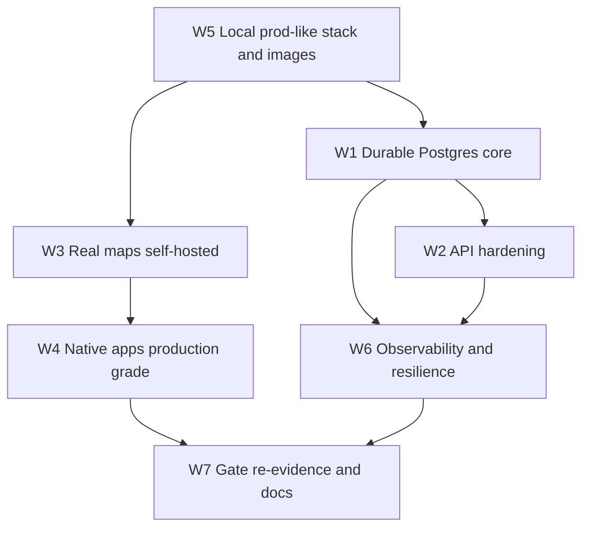

## Production grade ERP environment

### Assumptions from your answers

- Environment runs **locally first**, packaged deploy-agnostic (Dockerfiles + compose + docs). No Vercel/AWS/k8s commitment; a host can be chosen later without code changes.
- Maps are **self-hosted** (Planetiler + tileserver-gl + Nominatim + OSRM + VROOM), closing ENH-013 locally rather than waiting on ops.
- Work is committed to GitHub in reviewable batches per workstream.
- Map degradation surfaces a neutral status only (for example "Raster basemap"), never instructional helper text.

### What the audits found (the honest baseline)

- **Persistence:** `@dial/ledger`, `payments`, `jobs`, `promotions`, `tax`, and most of `catalogue`/`delivery` read from `globalThis` maps. `durableCommerce.ts` / `durableDelivery.ts` / `durableFactory.ts` only *write through*; nothing reads Postgres back. Gateway sessions are a `globalThis` Map, so a restart or a second instance loses every login.
- **Schema:** ~32 tables across [0001–0006](supabase/migrations); Pack §7 needs 100+. Entirely missing: technicians, jobs, projects, pricing, promotions suite, disputes, legal, trust, checklists, simulation, `psp_events`, `cod_attempts`, `fiscal_days`, `withholding_balances`, `itf263_records`, `audit_events`.
- **APIs:** 81 route handlers, zero schema validation (`as` casts). `api/grocery/track`, `api/spare/garage`, `api/spare/returns`, `api/grocery/slot` have no session at all — the caller supplies the identity. `assertResourceAccess` is wired in exactly one route. No rate limiting anywhere.
- **Maps:** `maplibre-gl` is not a dependency. [admin/delivery/track/page.tsx](apps/gateway-web/src/app/admin/delivery/track/page.tsx) fakes pins with `((loc.lng - 30.9) / 0.4) * 100`. The G5/G7 "MapLibre recon" screenshots are therefore stub evidence.
- **Native:** technician and delivery apps fail to compile (`import androidx.compose.ui.Modifier.Modifier`), are single debug screens, and claim Bluetooth/camera/GPS/MapLibre they do not have. iOS has **no Xcode project** — `App/DialCustomerApp.swift` is orphaned from `Package.swift`, so no `.ipa` can exist. No signing, icons, crash sink, or mobile CI in any app.
- **Deploy/ops:** no Dockerfile, no IaC, no backups, restore drill is a 4-step stub, no incident or degradation runbooks, health endpoint is public and leaks integration state.

### Sequencing

W5 comes first because W1's integration tests need real Postgres/Redis/Meili in one command.

### W5 — Local production-like stack and images

- `Dockerfile` for [apps/gateway-web](apps/gateway-web) using Next standalone output (`output: "standalone"` in [next.config.ts](apps/gateway-web/next.config.ts)), plus Dockerfiles for `apps/worker-temporal` and `apps/worker-queues`.
- `docker-compose.prod.yml` (deploy-agnostic): postgres, gateway, both workers, redis, meili, temporal + UI, and the maps profile from W3. Existing [docker-compose.yml](docker-compose.yml) stays the light dev path.
- `scripts/dev-up.ps1` / `.sh`: one command to boot infra, apply migrations, seed, and print health.
- Env contract fixes: add `DIAL_GATEWAY_BASE_URL` to [.env.example](.env.example); align `INTEGRATION_ENV_GROUPS` in [integrationsReadiness.ts](apps/gateway-web/src/lib/integrationsReadiness.ts) with `VROOM_URL`, `GEMINI_API_KEY`, `DATABASE_URL`, `WHATSAPP_WABA_ID`, `FDMS_DEVICE_SERIAL`.
- Checkov now has real IaC to scan and must stay HIGH/CRITICAL clean (non-root user, pinned digests, no secrets in build args).
- Runbook `docs/ops/local-production-environment.md`.

### W1 — Durable Postgres core

- Migrations `0007`–`00xx` closing the Pack §7 gap, each with RLS and indexes, grouped by area: customers/addresses/consents; technicians + trades_config; jobs + checklists; pricing; promotions suite; payments `psp_events`/`cod_attempts`; ledger `payouts`; fx versions/conversions; tax `fiscal_days`/`withholding_balances`/`itf263_records`/`tax_treatments`; delivery `zones`/`pod_media`/`runs`/`stops`/`assignment_events`; guarantee, disputes, legal, trust, simulation; platform `audit_events`/`feature_flags`/`metric_contracts`/`operational_alerts`.
- Reconcile naming drift with Pack §7 (`supplier_stock` → `stock_signals`, coop tables) via renaming migrations so the canonical inventory is the schema.
- Flip **read** paths per package: when `integrationMode()` is `sandbox|live`, read Postgres; keep memory strictly for fixture/CI. Order: `ledger` → `payments` → `catalogue` orders/carts/returns → `delivery` → `jobs` → `promotions` → `tax`.
- Session store out of process memory: Redis-backed sessions (or Supabase JWT verification) in [session.ts](apps/gateway-web/src/lib/auth/session.ts), so restart and multi-instance survive.
- CI: new job that boots compose Postgres/Redis/Meili, applies every migration, and runs integration tests against them — durability regressions fail the build.

### W2 — API hardening

- Shared Zod request layer in `packages/shared` (`parseJsonBody(schema)`), applied to all mutating routes, rejecting unknown fields, returning one error envelope `{ error, code, requestId }`.
- Close the IDOR set: session + object-level `assertResourceAccess` on `grocery/track`, `spare/garage`, `spare/returns`, `grocery/slot`, and every `:id`/order/job/vehicle route. Extend `dial-rls-idor-audit` and add a Semgrep rule so a route reading `customerId` from query fails CI.
- Redis token-bucket rate limiting on auth, checkout, search, and webhooks (in-memory fallback in fixture).
- Admin authorization: role-based admin session plus step-up for money operations; `INTERNAL_API_SECRET` narrows to machine-to-machine callers only.
- Health split: public `/api/health/live` (liveness only) versus protected `/api/health/integrations`.
- [middleware.ts](apps/gateway-web/src/middleware.ts): HSTS, Permissions-Policy, nonce-based CSP dropping prod `unsafe-inline`, and production origins from env instead of the localhost allowlist.
- Route-level integration tests for auth, checkout, webhook replay/bad-signature, and each fixed IDOR route.

### W3 — Real maps, self-hosted, blank-map-proof

Adopting the GTR implementation notes you asked for.

- Add `maplibre-gl`; build `DialMap` in `apps/gateway-web/src/components/map/` with: style URL from `MAP_TILES_STYLE_URL`, inline **raster fallback style** if the vector style JSON fails, a **10 s style watchdog**, `isStyleLoadError` classification, `ResizeObserver` → `map.resize()`, and re-apply of sources on `style.load` — mirroring `C:\Nissan GTR auto\apps\web\lib\map-basemap.ts` and `staff-delivery-live-map.tsx`.
- Replace every stub canvas with real GL: admin delivery [track](apps/gateway-web/src/app/admin/delivery/track/page.tsx) and [dispatch](apps/gateway-web/src/app/admin/delivery/dispatch/page.tsx), customer [delivery/track](apps/gateway-web/src/app/delivery/track/page.tsx), [delivery/courier](apps/gateway-web/src/app/delivery/courier/page.tsx), grocery track, and an address pin picker on [account/addresses](apps/gateway-web/src/app/account/addresses/page.tsx).
- `infra/maps/`: Planetiler prepare scripts producing a Zimbabwe `basemap.mbtiles` (~130 MB, z0–14, gitignored, simplified water), tileserver-gl on 8081, plus Nominatim, OSRM, and VROOM services in a compose profile. This closes **ENH-013** locally and makes `pingMapsHealth` genuinely green.
- Android native map module (`bridges/android/maps` style) carrying the GTR prevention rules verbatim, with unit tests for each decision function: `textureMode(true)`; never `setStyle` at 0×0 (`shouldWaitForMapLayout`, `shouldCommitStyleCallback`); tab hide keeps GL warm and never reloads style; after real `ON_STOP` resume repaints unless `getStyle()==null`, with ~120 ms deferred GL rebind; 2.5 s stall retry plus `addOnDidFailLoadingMapListener`; loopback/RFC1918 style URLs fall back to OpenFreeMap Liberty, never demotiles; MapLibre Android ≥ 11.8.5.

### W4 — Native apps to production grade

- Fix the compile blockers in [technician](apps/technician-android/app/src/main/java/zw/co/dial/technician/ui/TechnicianApp.kt) and [delivery](apps/delivery-android/app/src/main/java/zw/co/dial/delivery/ui/DeliveryApp.kt) (`Modifier.Modifier`).
- iOS: commit a real Xcode project (XcodeGen `project.yml` so it is reviewable and reproducible) wiring `App/DialCustomerApp.swift` + `DialCustomerCore`, asset catalog, entitlements, archive/export options — currently no `.ipa` is possible at all.
- Release plumbing on all four apps: `local` / `staging` / `prod` flavors (cleartext only in `local`), `signingConfig` reading the vault env names, R8 + ProGuard rules, launcher icons, real `versionCode`/`versionName`.
- Depth where the audit found single debug screens: technician gets job inbox → checklist → evidence capture (CameraX) → ITF263 → take-home, with real permissions; delivery gets offer inbox → native map navigation → POD capture → COD reconcile with a foreground-service location pipeline instead of button-triggered HTTP.
- Shared hardening: Keychain / EncryptedSharedPreferences session persistence, retry with backoff, an explicit misconfigured-gateway error state (not a silent empty base URL), and a crash-reporting hook that no-ops until a DSN is dropped in.
- Mobile CI jobs: Gradle assemble + unit tests; Swift build/test on a macOS runner.

### W6 — Observability, resilience, ops

- Structured logging (pino) with request correlation IDs threaded through routes and workers; OpenTelemetry-shaped so a collector is a config change.
- Error reporting behind env (no-op without DSN), plus a Prometheus text `/metrics` endpoint.
- Backup and restore for real: `pg_dump` + Meili dump scripts on a schedule, then execute a **timed restore drill** and record RTO/RPO evidence, replacing the stub at [restore-drill.md](docs/security/restore-drill.md).
- Write the runbooks G12 requires and the repo lacks: incident response, and degradation paths (§6.22) for Auth, Meili, PSP, WhatsApp, and maps outages.
- Data retention job plus Resend/Brevo consent path proven locally.

### W7 — Gate re-evidence, honesty, and docs

- Retract map-derived evidence: the G5 "admin MapLibre pin updates" and G7 Module E map cells were screenshots of a placeholder. Log a BUG, re-run the recon against the real GL map, and re-claim only then. G4/G8/G11 need re-evidence after W1 flips reads to Postgres, since their green rests partly on in-memory spines.
- Update [STATE](docs/planning/DIAL_Build_Workplan_STATE.md), the [Completion Plan](docs/planning/DIAL_Full_ERP_Completion_Plan.md) evidence boards, [key-drop-in-readiness.md](docs/integrations/key-drop-in-readiness.md) (its footer is stale), and living root docs in the same batches.
- Commit per workstream to GitHub.

### What stays blocked on you (no coding left after these arrive)

Real store signing (Play upload keystore, Apple distribution cert) and a public staging URL for G3/G6 device evidence; live EcoCash/Paynow portal keys; ENH-020 escrow partner; ENH-021 Meta WABA and approved template IDs; ENH-022 ZIMRA credentials; live Langfuse/Promptfoo keys; and Appendix C / S99, which remains yours alone. Everything above is built so these plug in without further code.