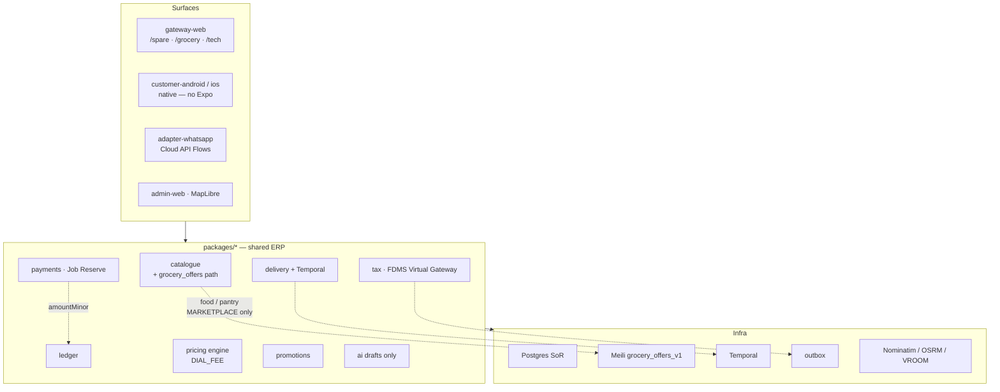

# ERP layer stack — Grocery branch (food / pantry)

**Type:** Layer stack (`dial-diagram-editorial` ← diagram-design)  
**Audience:** Eng  
**Scope:** Groceries **without liquor** — absorb into existing catalogue / payments / delivery / tax SoR  
**Locks:** D-58 agency; C-5 no Expo; D-44 maps; D-45 Temporal delivery; D-40 WA Cloud API only  
**Must show:** Grocery as Shop vertical on shared packages — not a parallel OMS/money SoR  
**Must not show:** `DIAL_OWNED` / principal stock; Medusa/Fleetbase as SoR; liquor licence layer

**Node / edge inventory**

| Layer | Nodes | Grocery note |
| --- | --- | --- |
| Surfaces | gateway-web, native, WA, admin | `/grocery/*` Shop tab; Harare metro |
| Packages | catalogue, payments, ledger, delivery, tax, pricing, promotions, ai | Grocery **reuses** E1a money spine; fee = `DIAL_FEE` |
| Infra | Postgres, Meili, Temporal, outbox, OSRM | Separate `grocery_offers_v1` index; same Temporal workflow |

**Focal accent:** `payments · Job Reserve` + `ledger` — money SoR stays DIAL packages.  
**Lock callouts:** AI drafts only (never payable); no Baileys; MapLibre client ≠ distance SoR.
