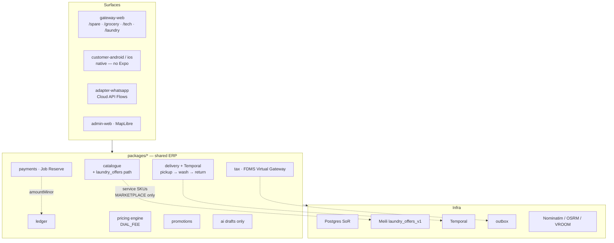

# ERP layer stack — Laundry branch

**Type:** Layer stack (`dial-diagram-editorial` ← diagram-design)  
**Audience:** Eng  
**Scope:** Dial Laundry — agency partner laundries / home washers; absorb into existing catalogue / payments / delivery / tax SoR  
**Locks:** D-58 agency; C-5 no Expo; D-44 maps; D-45 Temporal delivery; D-40 WA Cloud API only; D-57 FX; D-49 B2B hide informal  
**Must show:** Laundry as Services vertical on shared packages — not a parallel OMS/money SoR  
**Must not show:** `DIAL_OWNED` wash plants; Medusa/Fleetbase as SoR; cold-chain grocery layers

**Node / edge inventory**

| Layer | Nodes | Laundry note |
| --- | --- | --- |
| Surfaces | gateway-web, native, WA, admin | `/laundry/*` under **Services**; Harare metro |
| Packages | catalogue, payments, ledger, delivery, tax, pricing, promotions, ai | Reuses E1a money spine; logistics fee = `DIAL_FEE` |
| Infra | Postgres, Meili, Temporal, outbox, OSRM | Separate `laundry_offers_v1`; same Temporal workflow extended |

**Focal accent:** `payments · Job Reserve` + `ledger` — money SoR stays DIAL packages.  
**Lock callouts:** AI drafts only (never payable); textile SLA via delivery metadata — not a second job engine.
