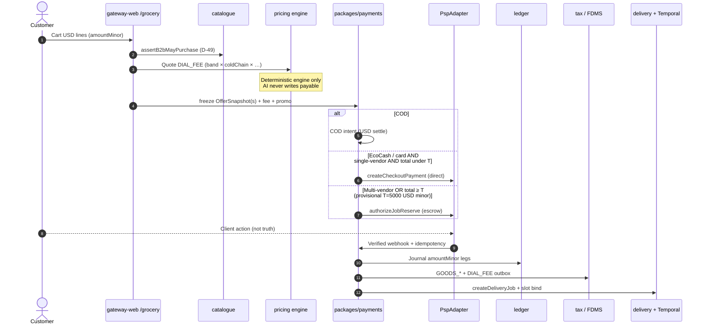

# Grocery order → money → escrow (food / pantry)

**Type:** Swimlane / sequence (`dial-diagram-editorial`)  
**Audience:** Eng / ops  
**Scope:** Agency grocery checkout — **no liquor**, no `T_liq`  
**Locks:** amountMinor; webhook-as-truth; D-58; D-59 FDMS; D-60 IMTT opex + COD USD; G-5 `DIAL_FEE`; G-6 escrow rule (food)  
**Must show:** OfferSnapshot freeze → direct vs Job Reserve → verified webhook → ledger → FDMS → delivery job  
**Must not show:** AI writing capture amounts; client return URL as truth; liquor high-ticket escrow path

### Escrow decision (food only — grill G-6 minus liquor)

| Condition | Path |
| --- | --- |
| COD | Direct COD intent → POD reconcile (D-60) |
| EcoCash / card, single vendor, total **< T** | Direct capture |
| Multi-vendor **OR** total **≥ T** | Job Reserve / escrow |
| ~~Liquor ≥ T_liq~~ | **Out of scope** this set |

**Provisional T:** 5000 USD minor ($50.00) — ops-tunable config, not statute.  
**Focal accent:** verified webhook → ledger.  
**After capture:** supplier payables + `DIAL_FEE` revenue; IMTT booked as DIAL opex (never customer line). Spoilage risk: supplier until POD; Dial-caused cold-chain fail → Dial (G-5).
