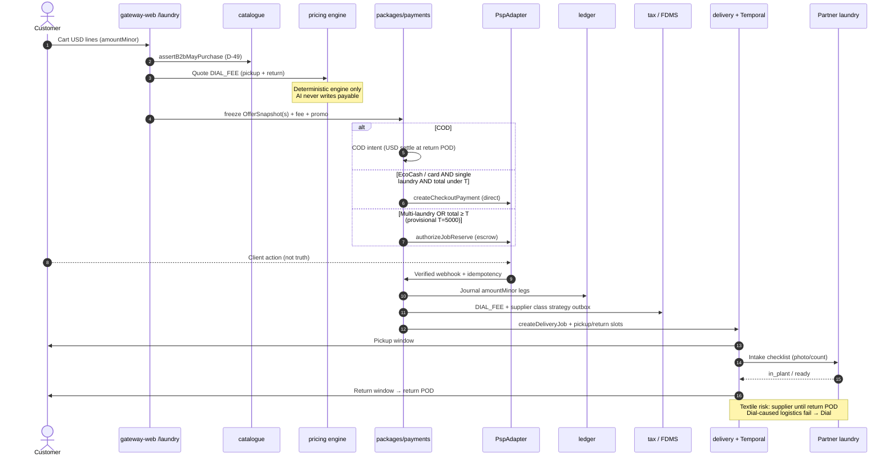

# Laundry order → money → textile SLA (pickup / wash / return)

**Type:** Swimlane / sequence (`dial-diagram-editorial`)  
**Audience:** Eng / ops  
**Scope:** Agency laundry checkout + multi-phase SLA — cold-chain N/A  
**Locks:** amountMinor; webhook-as-truth; D-58; D-59 FDMS; D-60 IMTT opex + COD USD; recommended `DIAL_FEE`; escrow rule (laundry)  
**Must show:** OfferSnapshot freeze → direct vs Job Reserve → verified webhook → ledger → FDMS → pickup → in_plant → return POD  
**Must not show:** AI writing capture amounts; client return URL as truth; Dial-owned plant as inventory SoR

### Escrow decision (recommended — grill L-6)

| Condition | Path |
| --- | --- |
| COD | Direct COD intent → return POD reconcile (D-60) |
| EcoCash / card, single laundry, total **< T** | Direct capture |
| Multi-laundry **OR** total **≥ T** | Job Reserve / escrow |
| High-value / delicate ≥ **T_hv** | Prefer escrow |

**Provisional T / T_hv:** 5000 / 10000 USD minor — ops-tunable config, not statute.  
**Focal accent:** verified webhook → ledger; SLA phases after money truth.  
**After capture:** supplier payables + `DIAL_FEE` revenue; IMTT = DIAL opex (never customer line).
