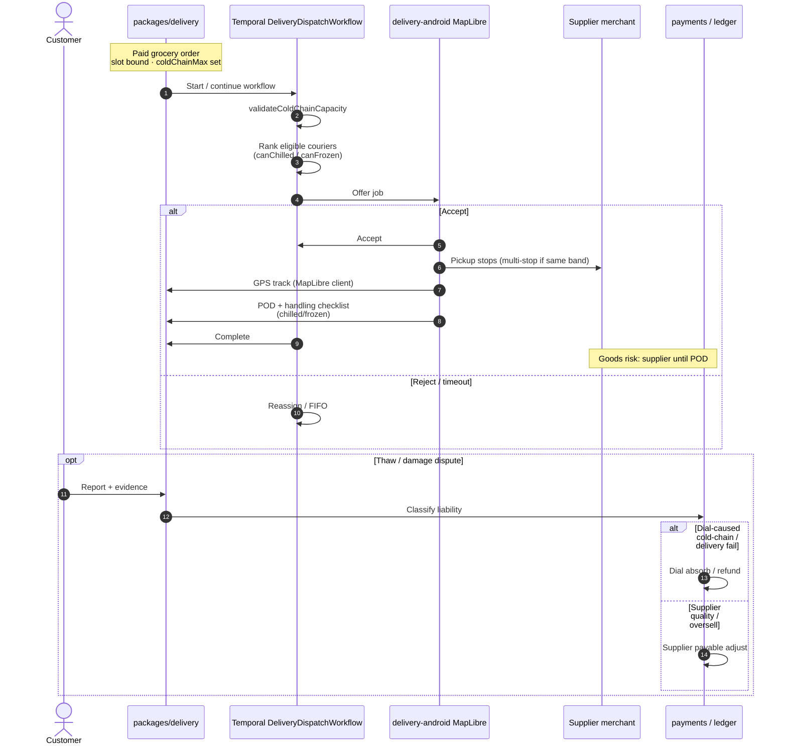

# Grocery delivery Temporal — POD / spoilage (food)

**Type:** Swimlane / sequence (`dial-diagram-editorial`)  
**Audience:** Eng / ops  
**Scope:** Harare metro grocery jobs; cold-chain checklist; **no** liquor age-check-at-door  
**Locks:** D-45 `packages/delivery` + `DeliveryDispatchWorkflow`; D-44 MapLibre/OSRM/VROOM; G-5 spoilage  
**Must show:** Extend existing workflow; cold-chain eligibility; POD + handling checklist; liability fork  
**Must not show:** Fleetbase as job SoR; Google/Mapbox distance SoR; liquor door ID flow

**Activities added on grocery (extend, do not fork SoR)**

| Activity | Role |
| --- | --- |
| `validateColdChainCapacity` | Filter before offer |
| `multiStopPlanVroom` | Multi-supplier same band/slot |
| `recordHandlingChecklist` | Chilled/frozen POD evidence |
| Offer → accept → reassign → FIFO | Unchanged D-45 core |

**Focal accent:** Temporal workflow — job engine SoR.  
**Lock callouts:** MVP checklist ≠ IoT temperature SoR; packed fixed weights only (no catch-weight payable adjust by AI).
