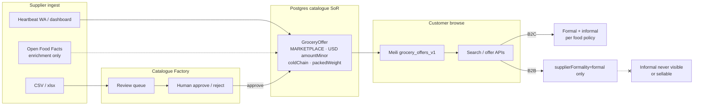

# Catalogue → Meili `grocery_offers_v1` + D-49 (food / pantry)

**Type:** Data flow (`dial-diagram-editorial`)  
**Audience:** Eng  
**Scope:** Food / pantry / non-liquor beverages · formal-first · packed fixed weights  
**Locks:** D-58 `offerSource=MARKETPLACE` only; D-49 B2B hide informal; D-53 Catalogue Factory human approve; D-57 USD in index  
**Must show:** Postgres SoR → human review → Meili browse; B2B forced formal filter  
**Must not show:** `DIAL_OWNED` publish; liquor licence publish gates; ZiG on browse docs

### Document fields that matter (food MVP)

| Field | Role |
| --- | --- |
| `currency: 'USD'` | D-57 — no ZiG on Meili docs |
| `offerSource: 'MARKETPLACE'` | Reject principal / owned |
| `supplierFormality` | D-49 filter + FDMS class |
| `coldChain` | TTL + courier eligibility |
| `availability` / `stockValidUntil` | Perishables heartbeat |
| `packedWeightGrams` / `unitLabel` | Fixed weights MVP |
| `supplierDisplayName` | Agency disclosure — never auth by client supplierId |

**B2B regression:** `countInformalB2bLeaks(grocery_offers_v1) === 0` + checkout `assertB2bMayPurchase`.  
**Focal accent:** B2B formal filter edge.  
**Policy note:** Food **formal-first** (grill); informal B2C may be narrowed by `informalAllowedCategories` — not shown as open liquor path.
