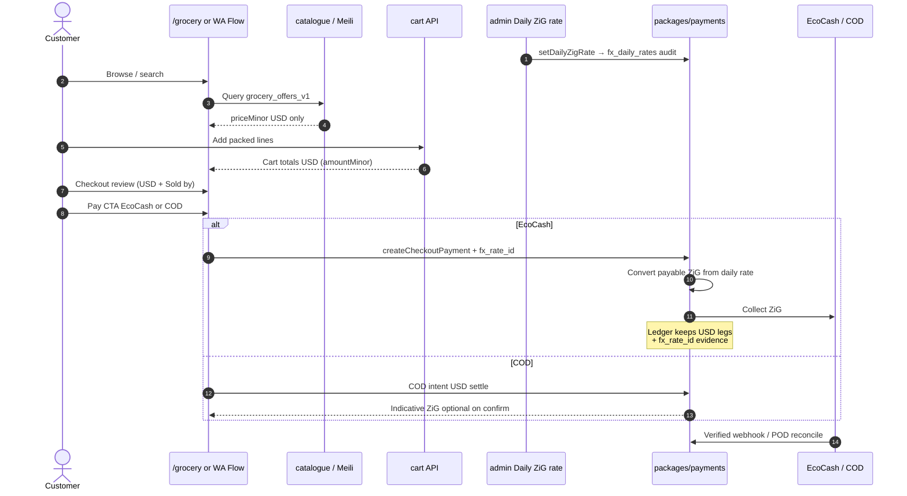

# FX — USD browse → ZiG at grocery checkout (D-57)

**Type:** Sequence (`dial-diagram-editorial`)  
**Audience:** Eng / ops  
**Scope:** Grocery food/pantry surfaces (web + WA parity)  
**Locks:** D-57 Spare FX pattern applied to grocery; D-60 COD USD + EcoCash buttons; ops-audited daily rate  
**Must show:** Browse/cart USD only; conversion only at pay; `fx_rate_id` freeze; EcoCash \| COD CTAs  
**Must not show:** Dual-display ZiG on PLP/cart; free-text pay method; AI inventing FX

**Surface rules**

| Step | Currency |
| --- | --- |
| Meili / PLP / PDP / cart | **USD only** |
| Review screen | USD totals + agency disclosure |
| EcoCash pay | **ZiG** from ops daily rate |
| COD | **USD** settle; ZiG indicative only |
| IMTT | DIAL opex — never a checkout line |

**Focal accent:** `fx_rate_id` at pay step.  
**Lock callouts:** Same ERP APIs for WA; buttons/CTAs required — not free-text method entry.
