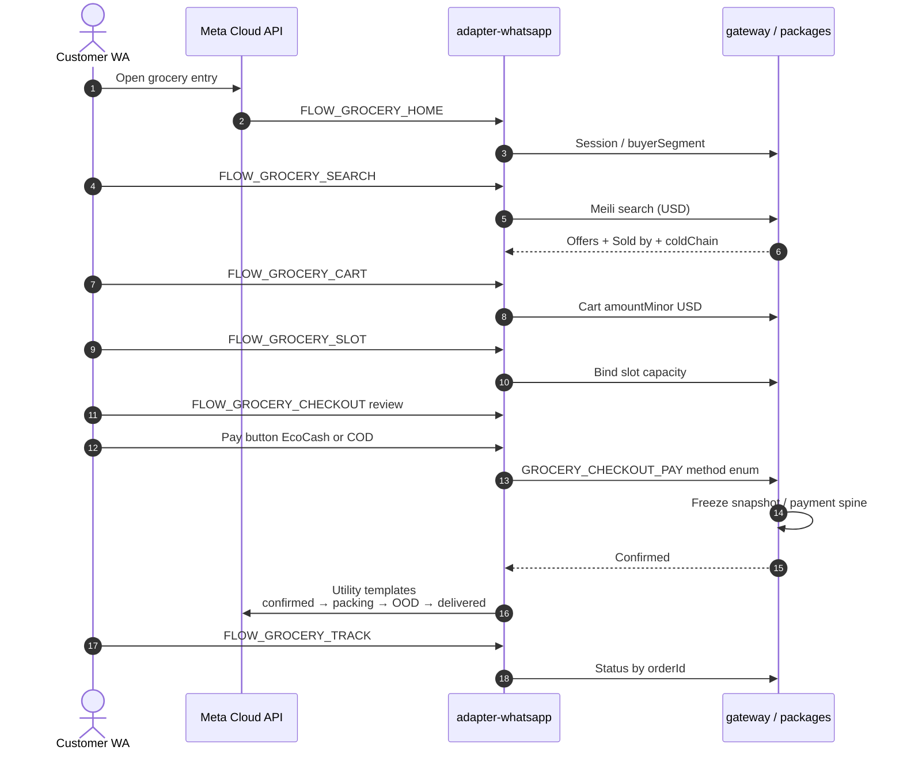

# WhatsApp grocery Flows — food / pantry only

**Type:** Sequence (`dial-diagram-editorial`)  
**Audience:** Eng  
**Scope:** Official Cloud API happy path for agency grocery — **no liquor screens / age-gate liquor ATC**  
**Locks:** D-40 Cloud API only; D-57 EcoCash\|COD buttons; WA never second money/catalogue SoR  
**Must show:** FLOW_GROCERY_* food path → same ERP APIs; server re-price  
**Must not show:** Baileys / unofficial clients; liquor age gate; client-trusted `priceMinor`

### Food-only Flow map (subset of plan Part 8)

| Flow | Purpose | Excluded here |
| --- | --- | --- |
| `FLOW_GROCERY_HOME` | Welcome · Shop groceries · Track | Liquor tile / age notice |
| `FLOW_GROCERY_SEARCH` | USD list / PDP / ATC | Age-gate liquor ATC |
| `FLOW_GROCERY_CART` | Lines by Sold by | — |
| `FLOW_GROCERY_SLOT` | Window + cold-chain notes | `liquorAllowed` slot flag as product surface |
| `FLOW_GROCERY_CHECKOUT` | Review + **EcoCash \| COD** buttons | Liquor T&Cs block |
| `FLOW_GROCERY_TRACK` | ERP status | — |
| `FLOW_SUPPLIER_GROCERY_HEARTBEAT` | Stock Yes/Sold-out | — |

**Focal accent:** Cloud API adapter → ERP (single SoR).  
**Server rule:** Never trust client `priceMinor`; re-price from catalogue/pricing engine.
