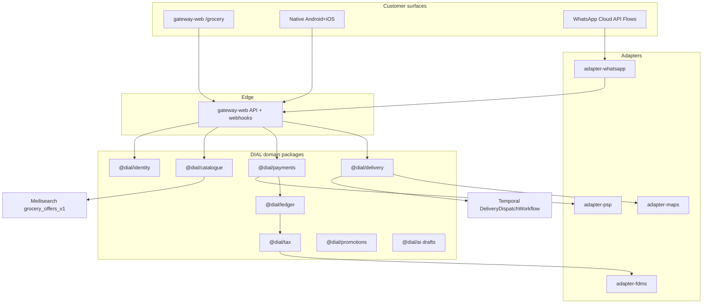

# Dial Groceries & Liquor — Branch Integration Plan (Peer-Depth)

**Status:** Plan-phase artifact (**D-52** / **D-56**). **Not product SoR.**  
**Date:** 2026-08-14 (enhanced revision)  
**Authority conflict order:** (1) `DIAL_Consolidated_Plan_v4.md` → (2) `DIAL_Development_Agent_Pack.md` → (3) Blueprint / WA / promotions companions → (4) this plan. **On any conflict, v4 + D-log win.**  
**Grill:** Founder grill Part 15 embeds `dial-grill-locks` questions. Run grill before scaffolding money / WA / maps / AI / catalogue / Intelligence for this branch.  
**Repo facts used:** `packages/{catalogue,payments,delivery,tax,ledger,promotions,ai,queues,search-indexer,shared}`, `adapters/{psp,fdms,maps,whatsapp}`, `apps/{gateway-web,worker-temporal,worker-queues}`, Pack §8 Meili shape, tracer matrices E1–E4, `DIAL_WhatsApp_Flows_and_Templates.md`, `DIAL_Promotions_Package_Design.md` patterns.

---

## Part 0 — How to read this, confidence & research gaps

### 0.1 Purpose and depth bar

This document is the **groceries & liquor vertical companion** to v4. It aims for **peer depth** with `DIAL_Consolidated_Plan_v4.md` in *section kinds*: market evidence, problem register, commercial/unit economics, tax/compliance with confidence tags, architecture, companion contracts, D-log-style decisions, launch checklist, open questions — adapted to a third Shop vertical under the same ERP.

It does **not** reopen locks. It does **not** replace Spare/Tech product SoR. It proposes **G-log draft decisions** pending founder (Part 13) — nothing here silently locks.

### 0.2 Confidence tags (same grammar as v4 §7)

| Tag | Meaning |
| --- | --- |
| **[Verified]** | Primary instrument, official notice, or locked DIAL D-log / Pack contract already in-repo |
| **[Reported]** | Credible secondary (law firm, ministry page summary, trade press) — not cross-checked to primary in this revision |
| **[Unverified]** | Research lead or common practice claim — **treat as false until counsel/ops confirm** |
| **[Founder-input]** | Placeholder cell — commercial number or policy the founder must supply |
| **[Engineering]** | DIAL implementation posture that does not invent statute |

**Honest status:** Liquor licensing, remote-sale hours, platform-vs-merchant licence holder, food-safety delivery duties, and CPA perishables carve-outs for electronic cancellation are **predominantly [Unverified] or [Reported]** in this plan. Engineering implements **configurable gates + audit trails**; counsel supplies numbers, copy, and who must hold what licence before customer-open.

### 0.3 What this document adds (relative to the short prior draft)

1. Market & problem register with competitor evidence and agency rationale.  
2. Dual-surface product inventories (web + native) + Shop hub + age-gate + catch-weight deferred.  
3. Commercial architecture with take-rate ladders, example `amountMinor` journals, spoilage scenarios, IMTT opex, multivendor split.  
4. Full Pack-§8-style `grocery_offers_v1` Meili schema + perishables heartbeat + optional Open Food Facts.  
5. Money path: E1a reuse, grocery OfferSnapshot fields, PspAdapter, COD USD, escrow decision table.  
6. Tax / FDMS / liquor compliance brief (v4 §7 style) + counsel checklist.  
7. Delivery / Temporal: slots, cold-chain, age-check-at-door, multi-stop, thawed-goods SOP.  
8. WhatsApp companion chapter (`FLOW_GROCERY_*`).  
9. AI capability contracts + Promptfoo + MetricContract.  
10. Security IDOR/RLS/age-gate audit.  
11. OSS stitch table (SoR vs pattern).  
12. Trains / tracer G0–G6 with filled DoD evidence columns.  
13. Proposed G-1…G-n decisions (pending founder).  
14. Launch checklist + ops KPIs.  
15. Expanded founder grill with answers-or-defaults.

### 0.4 Reading order for agents

1. v4 Parts 0–1 locks + D-49…D-61  
2. Agent Pack §2 non-negotiables + §8 Meili  
3. This plan (Parts 1–15)  
4. `DIAL_WhatsApp_Flows_and_Templates.md` style for Flow implementation (mirror, do not fork SoR)  
5. `dial-grill-locks` → ticket DoD → `dial-tracer-slice` Build  

### 0.5 Research gaps status (honest % vs v4)

| Gap cluster | Status | Blocks true 100% peer depth |
| --- | --- | --- |
| Liquor Act primary cite for age / remote delivery / platform liability | **[Unverified]** pending counsel | Yes — counsel brief Part 6.10 |
| Bottle-store / retail hours SI application to *delivery* | **[Reported]** Open Council / SI 197 of 2004 summaries — not counsel-confirmed for e-commerce | Yes |
| Food safety / cold-chain statutory duties for marketplace agent | **[Unverified]** | Yes |
| CPA § electronic cancellation vs perishables carve-out read-across | **[Reported]** via v4 §7.5 framing + Act text leads — counsel must map grocery SKUs | Yes |
| Founder commercial inputs (take rate, delivery fee owner, spoilage %) | **[Founder-input]** | Yes — unit economics incomplete |
| Escrow threshold policy for grocery | Grill Q8 / G-log | Soft block G1 money design |
| Launch geography / informal food policy | Grill | Soft block catalogue publish rules |

**Self-assessment:** Structural/engineering depth ≈ **~85–90% of v4 section kinds**. True **100%** requires founder commercial cells + Zimbabwe counsel opinions on liquor + food + CPA perishables (Part 6.10). Do not claim legal Verified without those opinions.

### 0.6 Hard locks (never reopen)

Agency **D-58** (no principal stock / no `DIAL_OWNED`); Job Reserve / ledger money SoR; **D-49** B2B hide informal; **D-57** USD browse + ZiG-at-checkout; **D-59** FDMS classes; **D-60** IMTT opex + COD USD; official WhatsApp Cloud API only; MapLibre + Nominatim/OSRM/VROOM SoR (**D-44**); AI never writes payable amounts; no Expo customer shell (**C-5**); delivery job SoR = `packages/delivery` + Temporal (**D-45**); promotions = `@dial/promotions` only (**D-42**).

---

## Part 1 — Market & problem register

### 1.1 Vision sentence (grocery vertical)

> **Dial Groceries & Liquor sells certainty that the right licensed merchant’s goods arrive in the booked window, at a frozen USD price the customer reviewed, with agency disclosure and door-level age controls for alcohol — without DIAL taking title to inventory.**

Everything in this vertical either produces that certainty (catalogue freshness, slots, cold-chain eligibility, age gates, ledger, FDMS) or distributes it (web, native, WhatsApp). Features that do neither stay off the critical path.

### 1.2 Market evidence `[Reported]` / `[Unverified]`

**Framing.** Public Zimbabwe grocery/liquor *marketplace* sizing with auditor-grade TAM is thin. This plan does **not** invent a false-precision TAM. Evidence below is competitive and behavioural — enough to shape product, not enough to replace founder unit-economics inputs.

| Fact / observation | Figure / note | Why it matters | Confidence | Source lead |
| --- | --- | --- | --- | --- |
| Established grocery delivery brand in ZW | TillPoint (formerly Fresh in a Box) — app claims same-day / “Deliver Now” windows, Harare-centric history since ~2018 | Incumbent **principal / first-party** fulfilment pattern; DIAL differentiates as **multivendor agency** | [Reported] | App Store / Play listings (TillPoint by Fresh in a Box) |
| On-demand horizontal delivery | Tambi marketing: food, groceries, medicine, liquor, packages | Liquor already appears in competitor messaging — age/hours are table stakes | [Reported] | tambi.mobi marketing |
| Retail marketplace pitch | Manna Store: connect to Spar / OK / Pick n Pay via riders; EcoCash + card | Multivendor + EcoCash is expected UX in Harare 2026 | [Reported] | LinkedIn / company pitch (treat volumes as marketing) |
| Supermarket chains present | OK, Spar, Pick n Pay, local bottle stores | Supply exists; digital aggregation + trust + cash mechanics are the hard parts (same lesson as Spare §1.2) | [Reported] | Market common knowledge + competitor copy |
| Mobile-money checkout | EcoCash ubiquitous; COD still culturally strong | Aligns **D-57** EcoCash\|COD buttons + **D-60** COD USD | [Verified] DIAL lock + market practice | v4 D-57 / D-60 |
| WA as commerce surface | High WA penetration (Spare premise) | Grocery MVP should include WA thin path (grill Q11 default) | [Reported] | v4 channel cost §4.6; Meta Rest of Africa rates |

**Competitive position (engineering implication).** Incumbents are mostly **owned-inventory or single-retailer** apps, or horizontal courier marketplaces. DIAL’s wedge is: **one ERP account** already used for Spare/Tech → Shop tab → groceries/liquor with **agency Sold by {Supplier}**, shared Job Reserve / FDMS / delivery SoR, and B2B formal-only filters. Software alone does not win; freshness heartbeat + slot capacity + liquor compliance ops do.

### 1.3 What comparable grocery ventures get wrong (lessons for DIAL)

| Failure mode | Lesson encoded in this plan |
| --- | --- |
| Principal inventory dark stores before unit economics | **Forbidden** without new D-log (**D-58**). Agency only. |
| Stale stock → refunds as primary recovery | Perishables heartbeat + short `stockValidUntil` + confirm-required (adapt Spare §2A-1) |
| Ignoring spoilage / failed delivery cost | Unit economics Part 3 includes spoilage % scenarios |
| Age gate only on UI, not API | Server-derived `ageGateRequired` + audit trail (Part 10) |
| Dual money systems for “grocery OMS” | Reject Medusa/Saleor/Fleetbase as SoR |
| Passing IMTT to customers | **D-60** — never a checkout line |
| Informal food visible to B2B | **D-49** filter at Meili/API |

### 1.4 Problem register — grocery/liquor specific

#### 1.4-1. Perishable oversell / stale availability

**Problem:** Fresh/chilled/frozen stock decays faster than Spare TTL defaults; CSV weekly uploads guarantee lies.  
**Solution posture:** State not quantity (`available` / `confirm_required` / `sourcing`); short TTL (e.g. 4–24h fresh — **[Founder-input]** exact); WA/dashboard **heartbeat** on top movers; shadow failover only for ambient/pantry same-brand where policy allows — **never silent brand/protein swap** without customer accept.  
**Measure:** confirm-failure rate, % orders saved vs refunded, spoilage write-offs charged to whom (grill Q6).

#### 1.4-2. Cold-chain break / thawed goods disputes

**Problem:** Customer claims thawed chicken; courier claims ambient delay.  
**Solution:** Job metadata `coldChain`; courier eligibility filter; POD photo + temperature checklist (MVP checklist, not IoT SoR); refund SOP Part 7.6; risk allocation in supplier contract **[Founder-input]**.

#### 1.4-3. Liquor age & hours non-compliance

**Problem:** Platform enables remote sale; enforcement historically targets licensed premises.  
**Solution:** Configurable `liquor_order_window`; ATC + checkout + door age-check; `liquor_licence_ref` on supplier; audit trail. Legal who-holds-licence = counsel (**Unverified** until then).

#### 1.4-4. Multivendor cart settlement bugs

**Problem:** One customer payment, N supplier payables + DIAL fee → drift.  
**Solution:** Integer `amountMinor` journals; one Intent/Job Reserve; split ledger lines; webhook idempotency; daily reconcile (v4 §4.2).

#### 1.4-5. Catch-weight price surprise

**Problem:** Sold-by-weight after pick adjusts payable — disputes + AI temptation.  
**Solution:** **MVP = packed fixed weights only** (grill Q13 default). Catch-weight = phase 2 with human pricing engine adjust — AI never writes payable.

#### 1.4-6. Informal food safety optics vs D-60 B2C informal

**Problem:** D-60 allows B2C informal Spare visibility; food may need stricter policy.  
**Solution:** Product policy flag `informalAllowedCategories`; default recommend formal-first food + formal-only liquor until counsel (grill Q5).

#### 1.4-7. Substitution UX vs agency disclosure

**Problem:** Out-of-stock banana → substitute brand looks like DIAL principal.  
**Solution:** Substitution suggestions return **offer ids** only (AI); customer accepts; Sold by remains supplier; price from catalogue engine.

#### 1.4-8. Slot capacity thrash / late delivery CPA risk

**Problem:** CPA delivery timing rights (v4 §7.5) + unreasonable time tenders.  
**Solution:** Capacity-decrement transactional holds; degrade messaging (Pack §6.22); reschedule Flow; counsel on cancellation fees for perishables.

#### 1.4-9. B2B pantry / fleet grocery informal leak

**Problem:** Same as Spare D-49 but SKU taxonomy differs.  
**Solution:** Identical Meili `supplierFormality=formal` filter + `assertB2bMayPurchase` + leak=0 tests on `grocery_offers_v1`.

#### 1.4-10. Promo cash-out pressure on groceries

**Problem:** High-frequency grocery invites wallet-like credit abuse.  
**Solution:** `@dial/promotions` only; promo credit **non-cash-out** (D-42 / §2B-30); vertical-scoped campaigns.

### 1.5 Why agency marketplace (not principal grocer)

| Criterion | Principal dark store | Agency marketplace (locked) |
| --- | --- | --- |
| Title / COGS | DIAL inventory | Supplier principal (**D-58**) |
| FDMS goods | VAT on GMV risk | `GOODS_FORMAL`/`INFORMAL` + `DIAL_FEE` (**D-59**) |
| Capital | Warehouses, spoilage inventory | Working capital on fees + float policy |
| Competitive wedge vs TillPoint-class | Race on assortment owned | Multivendor + ERP trust stack |
| Reopen cost | New D-log + counsel | N/A — do not scaffold `DIAL_OWNED` |

---

## Part 2 — Product dual-surface & scope

### 2.1 Shop hub placement `[Engineering]`

Authenticated Dial home (**v4 §1.4**): **Shop | Services**.  
Shop expands:

```text
Shop
  ├── Dial a Spare
  ├── Dial Groceries & Liquor   ← this vertical
  └── (future shop verticals)
Services
  └── Dial a Tech
```

Prefer routes under `apps/gateway-web` (`/grocery/*`) first; split `apps/grocery-web` only after bundle measurement (Pack ship-less-JS). Brand: Shop tab under Dial + clear branch branding; one account (grill Q12 default).

### 2.2 In-MVP (launch) — Full Feature MVP

**Catalogue & commerce**

- Multivendor grocery + liquor; `offerSource = MARKETPLACE` only.  
- Categories (ops taxonomy **[Founder-input]**): fresh, pantry, beverages, household, liquor (beer / wine / spirits / RTD).  
- `pricingMode = unit | weight` with **packed fixed weight** only in MVP (`amountMinor` per unit or per packed kg step — never float).  
- Cold-chain hints: `ambient | chilled | frozen | fragile`.  
- Restricted SKU / `ageGateRequired` for liquor.  
- Multi-vendor cart → one checkout → split settlement.  
- Meili `grocery_offers_v1`; Postgres catalogue SoR.  
- Supplier onboarding formal/informal + liquor licence fields; Catalogue Factory human approve before Meili publish (**D-53**).  
- Promotions via `@dial/promotions` only.

**Checkout & FX (D-57 adapted)**

- Browse/cart `displayCurrency = USD`.  
- ZiG only at pay step from `fx_daily_rates` / `fx_rate_id`.  
- Required CTAs: **EcoCash** + **COD** buttons (web + WA); other rails per **D-43**.  
- COD settle **USD** (**D-60**); indicative ZiG on confirm.  
- Eighteen-item electronic disclosure + review before pay (v4 §7.5) — grocery-adapted counsel copy.

**Delivery**

- Slot booking + capacity.  
- `packages/delivery` + `DeliveryDispatchWorkflow`.  
- MapLibre track; OSRM/VROOM.  
- Multi-stop when multi-supplier or batching.  
- Liquor age-check-at-door activity before POD.

**Surfaces:** web responsive; native Android+iOS (**not Expo**); WA Flows; admin; supplier portal (Mercur vendor-panel **pattern only**).

**Fiscal & money:** Job Reserve / authorize-capture per policy table Part 5; agency FDMS; same outbox drain.

**AI:** drafts only — guided shopping, substitution ids, ranking assist, ops summaries — MetricContract + Promptfoo + human promote.

### 2.3 Explicitly out of MVP

- DIAL-owned dark store / `DIAL_OWNED`.  
- Catch-weight post-pick price adjust (phase 2).  
- Subscription meal kits / recipe SoR / third-party grocery OMS as money SoR.  
- In-store POS as DIAL principal; click-and-collect unless founder prioritises.  
- Alcohol wholesale B2B licensing marketplace (separate counsel track).  
- AI-set prices; Simulated Command Centre auto-pay.  
- Baileys; Google/Mapbox SoR; Expo customer shell.  
- Cross-border grocery; national expansion beyond founder geography.  
- Customer wallet as money SoR; physical fiscal printers.

### 2.4 Web screen inventory (`gateway-web`)

| Route / screen | Purpose | Notes |
| --- | --- | --- |
| `/grocery` | Home / categories | Brand signal + search entry; USD |
| `/grocery/search` | Meili PLP | Facets: category, coldChain, ageGate, price, formality (server) |
| `/grocery/[offerId]` | PDP | Sold by {Supplier}; cold-chain badge; age-gate CTA |
| `/grocery/age-gate` | Attestation modal | Before liquor ATC; audit write |
| `/grocery/cart` | Cart | Multi-vendor grouping; USD only |
| `/grocery/slots` | Slot picker | Capacity remaining |
| `/grocery/checkout` | Review + disclosures | 18-item + agency |
| `/grocery/checkout/pay` | Pay step | EcoCash\|COD buttons; ZiG for EcoCash |
| `/grocery/orders/[id]` | Status | ERP status |
| `/grocery/orders/[id]/track` | MapLibre | Read-only Realtime |
| `/grocery/orders/[id]/returns` | Returns | Perishable / liquor policy |
| Support deep-link | Chatwoot | Attach orderId |

Responsive desktop + mobile; `@dial/design-tokens` (Blueprint §8.0.1).

### 2.5 Native screen inventory (Android + iOS — C-5)

| Screen | Notes |
| --- | --- |
| Grocery home / categories | Not Expo shell |
| Search + facets | Meili |
| PDP | Cold-chain + age-gate |
| Age attestation | Modal; biometric optional UX only — legal gate is attestation + door check |
| Cart | Multi-vendor Sold by groups |
| Slot picker | |
| Checkout review | Disclosures |
| Pay | EcoCash \| COD + other rails |
| Order status + MapLibre track | |
| Support | Chatwoot / WA deep-link |

Courier: **delivery-android** (**D-44**) — age-check + cold-chain handling UI (not customer Expo).

### 2.6 Liquor age-gate UX policy `[Engineering]` + counsel numbers `[Unverified]`

**Engineering chain (mandatory):**

1. Browse: liquor offers visible only if feature flag + hours window open (or browse-ok / ATC-blocked — prefer **ATC blocked outside hours**).  
2. Add-to-cart: hard gate — DOB attest or “I am 18+” with T&Cs; write `age_attestations`.  
3. Checkout: re-confirm; reject if any line `ageGateRequired` and attestation missing/expired.  
4. Door: Temporal activity `awaitAgeCheckAtDoor` — courier records pass/fail + method; **prefer no full ID image retention in MVP** unless counsel requires.  
5. API: server derives restricted flag from offer — client cannot omit.

**Reported public lead:** minimum purchase age commonly cited as **18** under Liquor Act Chapter 14:12 [Reported — Tripbase / IARD / secondary digests]. **Do not ship “18” as Verified legal copy until counsel cites Act section and remote-delivery application.** Config default may be `min_age=18` as engineering placeholder labelled counsel-pending.

### 2.7 Catch-weight deferred policy

| Mode | MVP | Phase 2 |
| --- | --- | --- |
| Packed fixed weight (e.g. 1kg bag) | **Yes** — OfferSnapshot freezes `amountMinor` | — |
| Catch-weight (scale at pick) | **No** | Human pricing-engine adjust + customer notify; new snapshot version; AI forbidden |

---

## Part 3 — Commercial architecture & unit economics

### 3.1 Pricing engine (deterministic — v4 §4.1)

```text
Customer line price (USD minor)
  = supplier net (valid, unexpired)
  + DIAL margin (category × supplier agreement)     [Founder-input ladder]
  + delivery allocation (band × coldChain class)    [Founder-input owner]
  + payment cost component (method)                 [modelled, not always shown]
  ± promotion (@dial/promotions only)
```

**Never:** AI prose prices; IMTT as customer line (**D-60**); float math.

Agency display: formal VAT-inclusive goods; informal no goods VAT line; Sold by {Supplier}; B2B formal-only (**D-49**).

### 3.2 Take-rate ladder (publish to supply) `[Founder-input]`

| Band | GMV / month / supplier (USD) | Commission on goods net | Notes |
| --- | --- | --- | --- |
| Launch | — | **[Founder-input]** e.g. target low-teens blended | Start low; earn increases (v4 §4.4 lesson) |
| Growth | — | **[Founder-input]** | Volume / SLA / heartbeat compliance |
| Preferred | — | **[Founder-input]** | Promoted placement ≠ money SoR change |

Delivery fee options (pick one in grill Q6):

| Option | Customer sees | FDMS | Risk |
| --- | --- | --- | --- |
| **A. DIAL delivery fee** (recommended default) | `DIAL_FEE` line | DIAL VAT on fee | DIAL ops cost vs courier payable |
| B. Pass-through courier | Courier component | Careful agency characterisation | Looks like logistics principal |
| C. Supplier-absorbed | “Free delivery” funded in margin | Margin only | Hide true cost |

### 3.3 Example journals (`amountMinor`) — illustrative only

**Scenario:** Customer cart — Supplier A pantry $12.00 + Supplier B liquor $20.00 + DIAL delivery fee $3.00 = **$35.00** USD.  
`amountMinor` scale = cents → `3500` total.

**EcoCash capture (after FX to ZiG at pay — ledger still records USD legs + fx_rate_id as designed):**

```text
// On verified webhook capture (idempotent)
Dr  cash_psp_clearing          3500 USD
Cr  customer_clearing          3500 USD

// Allocate (same txn or follow-on balanced entries)
Dr  customer_clearing          3500
Cr  supplier_payable_A         1200   // goods A — settlement net of commission per contract
Cr  supplier_payable_B         2000
Cr  dial_fee_revenue            300   // delivery fee example
// Commission skim alternative: reduce payables and Cr dial_commission_revenue
```

**IMTT:** book **DIAL opex** expense when PSP invoices / bank applies — **never** `Cr customer` surcharge line.

**COD:** intent `COD` → on POD `reconcileCodAfterPod` → cash_courier / customer_clearing per existing delivery patterns; settle USD.

**Failed delivery / spoilage refund (supplier bears — example policy):**

```text
Dr  supplier_payable_A   500   // reverse goods
Cr  cash_psp_refund      500   // or customer_clearing credit
```

Exact commission skim vs gross payable = **[Founder-input]** contract template.

### 3.4 Unit economics skeleton (no line may be deleted)

**Per grocery order**

```text
+ Customer price (USD minor sum)
− Supplier net cost(s)
− Delivery cost (courier zone + cold-chain premium)
− Failed-attempt cost × failure_rate                    [Founder-input]
− Spoilage / thaw write-off × spoilage_rate             [Founder-input]
− Payment processing (EcoCash / card / COD variance)
− IMTT economic cost on collection + payout legs (opex) [model ~3.5–4% USD round-trip unless counsel/PSP better — v4 §7.2]
− Grocery WHT if counsel says applicable (NOT auto 30% tech D-50)
− Refund/return cost × return_rate (CPA-aware)
− Oversell/failover cost × confirm_fail_rate
− Ops minutes × loaded cost
− AI cost per order (budgeted)
− WA template cost (utility vs marketing — v4 §4.6)
− Guarantee / food-safety provision %
= Contribution per order
```

**Spoilage / failed-delivery scenarios (illustrative sensitivity)**

| Scenario | Spoilage % of chilled GMV | Failed delivery % | Contribution impact |
| --- | --- | --- | --- |
| Base | **[Founder-input]** e.g. 1.5% | **[Founder-input]** e.g. 3% | Model |
| Stress | 4% | 8% | Often negative at thin take-rate |
| Controlled | 0.5% + supplier SLA | 2% + slot discipline | Target |

### 3.5 Multivendor split settlement under agency

1. Single customer authorization/capture for order total.  
2. Ledger N× `supplier_payable` + `dial_fee_revenue` (+ promo components).  
3. Payout via PspAdapter `instructRelease` / batch when escrow; else T+N schedule **[Founder-input]**.  
4. Per-supplier FDMS `GOODS_*` + one or more `DIAL_FEE` receipts (**D-59**).  
5. Never net informal goods into B2B Valid VAT claims.

### 3.6 Channel costs (reuse v4 §4.6)

Zimbabwe (+263) → Meta “Rest of Africa”: utility ~$0.0040; marketing ~$0.0225 per delivered template [Reported — Meta pricing; re-verify]. Prefer session messages; grocery heartbeats as utility inside open windows.

### 3.7 Promotions (D-41a / D-42)

| Campaign | Grocery use |
| --- | --- |
| `PLATFORM` | Delivery fee off / first-order credit (non-cash) |
| `SUPPLIER_COOP` | Supplier-funded % on their SKUs |
| `REFERRAL` | Optional; fraud graph; no cash-out |
| `FLASH` | Time-boxed; stock heartbeat required |

---

## Part 4 — Catalogue / Meili (`grocery_offers_v1`)

### 4.1 Index choice

**Recommend separate index** `grocery_offers_v1` (not Spare chassis/OEM fields). Unified index with `vertical` filter is acceptable later; separate keeps searchableAttributes clean.

Postgres remains catalogue SoR; Meili = customer browse (**Pack §8** doctrine).

### 4.2 Document shape (Pack §8 style)

```ts
export interface GroceryOfferDocument {
  id: string                       // offerId
  masterProductId: string
  title: string
  description: string
  brand?: string
  barcode?: string                 // EAN/UPC when known
  categoryPath: string[]           // e.g. ["fresh","dairy"]
  vertical: 'grocery' | 'liquor'   // liquor may also be category under grocery — pick one convention in ticket
  pricingMode: 'unit' | 'weight'
  priceMinor: number               // USD cents per unit OR per packed weight step
  currency: 'USD'                  // D-57 — no ZiG on browse docs
  packedWeightGrams?: number       // MVP packed only
  unitLabel: string                // "each" | "500g" | "1L"
  availability: 'available' | 'confirm_required' | 'sourcing'
  coldChain: 'ambient' | 'chilled' | 'frozen' | 'fragile'
  ageGateRequired: boolean
  hasRestrictedSku: boolean
  liquorCategory?: 'beer' | 'wine' | 'spirits' | 'rtd' | 'other'
  deliveryBandId: string
  stockValidUntil: number          // unix ms — short for perishables
  offerSource: 'MARKETPLACE'       // D-58 — reject DIAL_OWNED
  supplierFormality: 'formal' | 'informal'  // D-49
  supplierDisplayName: string      // display only — NEVER authorize by client supplierId
  imageUrl?: string
  offEnrichment?: {                // optional Open Food Facts — enrichment only
    productName?: string
    nutriscore?: string
    categoriesTags?: string[]
  }
  // NEVER index raw supplierId for customer search responses
}
```

### 4.3 Settings

```json
{
  "searchableAttributes": [
    "title",
    "description",
    "brand",
    "barcode",
    "categoryPath",
    "supplierDisplayName"
  ],
  "filterableAttributes": [
    "vertical",
    "categoryPath",
    "pricingMode",
    "availability",
    "coldChain",
    "ageGateRequired",
    "hasRestrictedSku",
    "liquorCategory",
    "currency",
    "deliveryBandId",
    "priceMinor",
    "stockValidUntil",
    "offerSource",
    "supplierFormality"
  ],
  "sortableAttributes": ["priceMinor", "stockValidUntil"],
  "displayedAttributes": [
    "id", "masterProductId", "title", "description", "brand", "barcode",
    "categoryPath", "vertical", "pricingMode", "priceMinor", "currency",
    "unitLabel", "packedWeightGrams", "availability", "coldChain",
    "ageGateRequired", "hasRestrictedSku", "liquorCategory", "deliveryBandId",
    "stockValidUntil", "offerSource", "supplierFormality", "supplierDisplayName",
    "imageUrl"
  ]
}
```

**B2B (D-49):** force `supplierFormality = formal` on Meili + offer list APIs + checkout `assertB2bMayPurchase`. Regression: `countInformalB2bLeaks(grocery_offers_v1) === 0`.

**Display currency (D-57):** USD only in index and cart APIs.

### 4.4 Import / heartbeat for perishables

| Path | Use | Outcome |
| --- | --- | --- |
| CSV / xlsx supplier import | Bulk catalogue | Catalogue Factory review queue (**D-53**) |
| Targeted heartbeat (WA utility / dashboard) | Top movers this week | Refresh `stockValidUntil` / availability |
| Photo/PDF price list OCR | Optional | Same `SupplierStockRow` + source field |
| Open Food Facts API | Optional enrichment by barcode | **Not** price/availability SoR; ODbL attribution |

**Freshness defaults (engineering proposals — founder/ops override):**

| coldChain | Default stock TTL | Heartbeat cadence |
| --- | --- | --- |
| ambient pantry | 7d | weekly top-N |
| chilled | 24–48h | daily |
| frozen | 48–72h | daily |
| liquor ambient | 14d | weekly |

On expiry → degrade to `confirm_required`, do not silent-delete (Spare §2A-1 pattern).

### 4.5 Restricted / liquor publish gates

Before Meili publish: `offerSource=MARKETPLACE`; if liquor → `liquor_licence_ref` present & not expired (when policy on); `ageGateRequired=true`; hours config does not need to hide browse but must block ATC/checkout.

---

## Part 5 — Money path (E1a reuse)

### 5.1 End-to-end spine

```text
Cart (USD lines, amountMinor)
  → assertB2bMayPurchase(formality) per line (D-49)
  → assertAgeGate + liquor hours
  → freeze OfferSnapshot(s) per supplier + DIAL fee + promo components
  → createCheckoutPayment(EcoCash|COD|…) OR authorizeJobReserve (escrow)
  → customer action ≠ truth
  → verified PSP webhook + claimProcessedEvent
  → ledger journal
  → enqueueFiscalReceipt GOODS_* + DIAL_FEE
  → money outbox → FDMS Virtual Gateway
  → createDeliveryJob(s) + slot bind + start DeliveryDispatchWorkflow
```

Reuse: `freezeOfferSnapshot`, `createCheckoutPayment`, `authorizeJobReserve`, `runE1aMoneySpine`, `@dial/tax` — **do not duplicate**.

### 5.2 Grocery-specific OfferSnapshot fields

| Field | Purpose |
| --- | --- |
| `vertical` | `grocery` \| `liquor` |
| `supplierDisplayName` | Agency disclosure freeze |
| `supplierFormality` | FDMS class selection |
| `coldChain` | Job metadata |
| `ageGateRequired` | Door check + audit link |
| `slotId` | Capacity bind |
| `packedWeightGrams` / `unitLabel` | Dispute evidence |
| `pricingMode` | unit \| weight (packed) |
| `fx_rate_id` | When ZiG pay conversion |
| `promo_campaign_id[]` | Logged components |
| `liquor_licence_ref` (supplier snapshot) | Compliance evidence |

AI **must not** write any payable keys (`assertNoPayableKeys`).

### 5.3 PspAdapter rails (D-43)

| Rail | Grocery MVP posture |
| --- | --- |
| EcoCash | Required button; ZiG payable from daily rate |
| COD | Required button; USD settle |
| Paynow | URL / escrow-first ask (D-60) |
| ContiPay | As enabled |
| PayPal Orders v2 | As enabled |
| Escrow / Job Reserve | Per decision table below |

### 5.4 Escrow vs direct capture — decision table

| Condition | Path | Rationale |
| --- | --- | --- |
| COD | Direct COD intent → POD reconcile | D-60 |
| EcoCash / card below threshold T | Direct capture | Speed; low ticket |
| Multi-vendor OR total ≥ T | Job Reserve / escrow hold | Dispute / split release |
| Liquor-only high ticket ≥ T_liq | Escrow preferred | Returns / age-fail refunds |
| B2B formal | Escrow or Net terms **[Founder-input]** | TIN capture |

**T, T_liq:** grill-accepted **provisional** defaults (ops-tunable config — not statute): **T = 5000** USD minor ($50.00); **T_liq = 10000** USD minor ($100.00). Engineering: strategy interface, not hard-coded magic numbers in adapters.

### 5.5 WHT note (D-50 boundary)

Tech hire 30% ITF263 path stays for **Dial a Tech**. Grocery supplier payouts: **pluggable withholding strategy**; do **not** auto-apply 30% tech WHT; counsel decides marketplace commission/payout WHT (**Unverified** applicability).

---

## Part 6 — Tax / FDMS / liquor compliance brief

**How to read:** Research, not legal advice. Tags per Part 0.2. Mirror v4 §7 honesty.

### 6.0 Load-bearing inheritance from v4 (do not re-litigate)

| Topic | Lock | Confidence |
| --- | --- | --- |
| Agency characterisation | D-2 / **D-58** | [Verified] founder lock |
| FDMS receipt classes | **D-59** `DIAL_FEE` / `GOODS_FORMAL` / `GOODS_INFORMAL` | [Verified] lock |
| Virtual fiscalisation | D-40a | [Verified] lock |
| VAT 15.5% from 2026 | v4 §7.1 | [Verified] in v4 research |
| IMTT = opex | **D-60** | [Verified] lock |
| COD USD | **D-60** | [Verified] lock |
| CPA electronic disclosure + 7-day cancel | v4 §7.5 | [Verified] Act framing in v4 — grocery read-across **counsel** |
| Job Reserve needs licensed PSP escrow | C-4 / §7.3 | [Verified] RBZ posture in v4 |

### 6.1 VAT & agency FDMS for grocery lines

Same as Spare agency model:

- DIAL taxable supply = **fees/commission** → `DIAL_FEE` (+ VAT on fee).  
- Formal supplier goods → `GOODS_FORMAL` (supplier deemed seller; VAT-inclusive; single invoice on-behalf rules per D-59).  
- Informal goods → `GOODS_INFORMAL` (no goods VAT line; **never B2B**).  
- No GMV VAT split-pot as principal.  
- Buyer TIN for B2B Valid claims (v4 §7.1).

### 6.2 Liquor licensing & hours

| Topic | Public research lead | Tag | Engineering |
| --- | --- | --- | --- |
| Governing statute | Liquor Act Chapter **14:12**; Liquor Licensing under Ministry of Local Government | [Reported] | Store licence type + ref + expiry on supplier |
| Licence types | Retail, wholesale, restaurant, hotel, bottle store, etc. | [Reported] MLG / Act schedule summaries | `liquor_licence_type` enum ops-configured |
| Operating hours | SI summaries e.g. bottle store often cited **08:00–20:00**; bars **10:00–23:00** (Open Council / SI 197 of 2004 digests) | [Reported] | `liquor_order_window` config per band — **fail closed** |
| Apply hours to *delivery / remote sale*? | Not established in this research | **[Unverified]** | Assume restricted until counsel says otherwise |
| Who must hold licence for marketplace delivery? | Platform vs each merchant | **[Unverified]** | Default eng: **merchant holds**; block liquor publish without ref |
| Sale to minors | Commonly cited 18+; supply to under-18 offence; some digests note guardian-consent nuances | [Reported] | Config `min_age`; door check; **counsel copy** |
| Credit sales of liquor | News commentary cites prohibitions on credit liquor sales | [Reported] | Prefer no “buy now pay later” for liquor SKUs |
| National Alcohol Policy reforms | Government review of licensing/hours reported | [Reported] | Keep hours **config-driven** |

### 6.3 Food safety & delivery notes

| Topic | Tag | Engineering / ops |
| --- | --- | --- |
| Mandatory safety/quality standards for goods marketed | [Reported] CPA s. goods safety themes / v4 product liability | Supplier warranties + indemnity; evidence photos |
| Cold-chain statutory IoT logging | **[Unverified]** | MVP = eligibility + checklist; not IoT SoR |
| Who is “supplier” for unsafe food on agency marketplace | **[Unverified]** — v4 §7.5 joint-and-several risk applies to platforms in spirit | Contracts + insurance; counsel |
| Allergen / labelling | **[Unverified]** detail | Display supplier-provided fields; OFF enrichment optional |

### 6.4 Consumer protection — perishables `[Reported]` / counsel

v4 §7.5: electronic transactions have strong cancellation / disclosure rules [Verified in v4]. Perishable exclusions for some cooling-off contexts are often discussed; **whether they read across to grocery e-commerce cancellation** is a **counsel question** (v4 already flags carve-out ambiguity).  

**Engineering SOP pending counsel:**

- Eighteen-item disclosure + review on web/WA/native.  
- Clear perishable / opened-liquor return policy in ERP + T&Cs module (§3.8 pattern).  
- Thawed-goods refund path (Part 7.6) without waiting for perfect legal taxonomy.  
- Do not silently exclude statutory rights in UI copy.

### 6.5 Data protection (age attestations)

Age attestations and optional ID checks are personal data. Apply v4 §7.6 / D-32: minimise retention; prefer boolean + method + timestamp; POTRAZ licence; cross-border AI must not receive ID images / names / phones.

### 6.6 Counsel checklist (grocery/liquor addendum to v4 §7.10)

**Must confirm before customer-open of liquor SKUs:**

1. Minimum age and acceptable ID types for *delivery* handover.  
2. Whether Liquor Act hours bind remote acceptance of orders vs only on-premises sale.  
3. Whether DIAL as agent needs any liquor licence, or only merchants.  
4. Advertising restrictions for alcohol on WA marketing templates.  
5. Food business registration / municipal permits for suppliers on platform.  
6. CPA cancellation / returns for perishables and alcohol (opened vs unopened).  
7. Product liability allocation for unsafe food delivered via DIAL couriers.  
8. Whether informal food traders may be B2C-visible (policy + law).  
9. WHT / VAT marketplace specifics for grocery commissions (beyond tech D-50).  
10. Credit-sale prohibition implications for COD vs postpaid liquor.

### 6.7 What could not be verified (grocery-specific)

- Primary-section citation for remote liquor delivery age check duties.  
- Binding hours for e-commerce liquor order *placement* vs *handover*.  
- Platform liquor licence category (if any).  
- Specific municipal food-handler certificate matrix per Harare district.  
- Exact CPA perishable carve-out application to § electronic cancellation.  
- Competitor GMV / take rates (marketing noise only).

---

## Part 7 — Delivery / Temporal

### 7.1 Slot capacity model

```text
DeliverySlot {
  slotId, bandId, windowStart, windowEnd,
  capacityTotal, capacityReserved, capacityRemaining,
  coldChainAllowed: ambient[] | chilled | frozen,
  liquorAllowed: boolean
}
```

- Checkout binds `slotId` with **transactional** decrement (Postgres); idempotent hold key = `cartId|orderId`.  
- Release hold on cancel / payment fail TTL.  
- Missed slot → Temporal timer → WA utility notify → reschedule Flow.

### 7.2 Workflow recommendation

**Extend `DeliveryDispatchWorkflow`** (preferred) — do not invent parallel job SoR.

| Activity | When |
| --- | --- |
| `validateColdChainCapacity` | Offer ranking / assign |
| `multiStopPlanVroom` | Multi-supplier / batch |
| `awaitAgeCheckAtDoor` | `ageCheckRequired` |
| `recordHandlingChecklist` | chilled/frozen POD |
| Existing offer→accept→reassign→FIFO | Unchanged (**D-45**) |

Algorithm donor: AWS Last Mile Hyperlocal MIT-0 patterns inside `packages/delivery` (**D-45a**) — not Fleetbase.

### 7.3 Cold-chain eligibility

- Courier profile flags: `canChilled`, `canFrozen`, bag type.  
- Job `coldChainMax` = max severity among lines.  
- Ineligible couriers filtered before offer.  
- MVP: no continuous temperature SoR; optional phase-2 logger.

### 7.4 Age-check-at-door

```text
ageCheckStatus: pending → passed | failed | skipped_not_required
```

- Failed → cancel/return-to-supplier path + refund policy (founder).  
- Store: timestamp, courierId, method (`visual_id` | `dob_match` | `refused`), result — **not** full ID image unless counsel mandates secure upload.

### 7.5 Multi-stop

- Cart with suppliers A+B → either one job multi-stop or N jobs — **[Founder-input]** default: **one job multi-stop when same band/slot**, else split.  
- VROOM plan returns stopSequence; customer track shows aggregated ETA honesty.

### 7.6 Refunds for thawed / damaged goods — SOP (ops)

| Step | Owner | System |
| --- | --- | --- |
| 1. Customer reports within policy window | Support | Ticket + orderId |
| 2. Evidence: POD photo + customer photo | Support/courier | Attachments |
| 3. Classify: `thaw_suspected` / `damaged_transit` / `wrong_item` / `quality` | Support | Taxonomy |
| 4. Liability: courier vs supplier vs DIAL fee absorb | Ops rules **[Founder-input]** | Ledger reason codes |
| 5. Refund / replace / partial | Payments | Idempotent refund + fiscal credit note path |
| 6. Supplier score / oversell fee if confirm failure | Catalogue | Statement line |

Opened liquor: default **no return** unless defect — counsel copy.

---

## Part 8 — WhatsApp companion chapter

**Align style with** `DIAL_WhatsApp_Flows_and_Templates.md`. Official Cloud API only. Same ERP APIs — WA never second SoR. **D-57:** USD browse/cart; EcoCash\|COD **buttons**; **D-58/D-59** fiscal outbox shared.

### 8.1 Happy path

```text
Menu → FLOW_GROCERY_HOME
  → FLOW_GROCERY_SEARCH (Meili) — USD prices
  → Age gate screen if liquor add
  → FLOW_GROCERY_CART (USD)
  → FLOW_GROCERY_SLOT
  → FLOW_GROCERY_CHECKOUT (disclosure review)
  → Pay buttons: EcoCash | COD | other
  → Utilities: order_confirmed → packing → out_for_delivery → delivered
  → FLOW_GROCERY_TRACK
```

### 8.2 Flow screen maps

#### `FLOW_GROCERY_HOME`

Screens: Welcome · Shop groceries · Liquor (age notice) · Track · Live chat  

#### `FLOW_GROCERY_SEARCH`

| Screen | Fields / logic |
| --- | --- |
| Query | Text; category chips optional |
| Results | `data_exchange` list: title, unitLabel, **priceMinor USD**, coldChain, Sold by display, ageGate badge |
| PDP | Detail; ATC |
| Age gate | If `ageGateRequired` — attest before ATC write |

#### `FLOW_GROCERY_CART`

Lines grouped by Sold by; edit qty; USD totals; continue / checkout.

#### `FLOW_GROCERY_SLOT`

Select window; show remaining capacity; cold-chain notes.

#### `FLOW_GROCERY_CHECKOUT`

| Screen | Purpose |
| --- | --- |
| Delivery | Saved place / pin+landmark+phone |
| Buyer tax | Optional VAT/TIN B2B |
| Review | USD totals, suppliers, cancellation/perishable summary, T&Cs — **mandatory** |
| Pay | **Buttons/CTAs:** EcoCash \| COD \| Paynow/other — **not free-text**. EcoCash → ZiG + `fx_rate_id`. COD → USD + indicative ZiG |

#### `FLOW_GROCERY_TRACK`

Order id → ERP status (not Chatwoot).

#### `FLOW_GROCERY_RETURNS` (MVP)

Reason taxonomy; media; liquor opened block messaging.

#### `FLOW_SUPPLIER_GROCERY_HEARTBEAT`

Supplier Yes/Sold-out on listed SKUs (utility).

### 8.3 `data_exchange` stubs (TypeScript-shaped)

```ts
type GroceryFlowRequest =
  | { screen: 'GROCERY_SEARCH'; data: { query: string; categoryPath?: string[] } }
  | { screen: 'GROCERY_ADD_CART'; data: { offerId: string; qty: number; ageAttestToken?: string } }
  | { screen: 'GROCERY_SET_SLOT'; data: { cartId: string; slotId: string } }
  | { screen: 'GROCERY_APPLY_PROMO'; data: { code: string; cartId: string } }
  | { screen: 'GROCERY_CHECKOUT_PAY'; data: { orderId: string; method: 'ECOCASH' | 'COD' | 'PAYNOW' | 'OTHER' } }
```

Server re-prices from ERP; never trust client `priceMinor`.

### 8.4 Templates register

| Template name | Category | When | Body shell |
| --- | --- | --- | --- |
| `grocery_welcome_menu` | UTILITY | Opt-in / link | Hi {{1}}. Groceries, Track, Live chat. |
| `grocery_order_confirmed` | UTILITY | Paid | Order {{1}} confirmed. Total {{2}} {{3}}. Slot {{4}}. |
| `grocery_supplier_confirming` | UTILITY | Confirm SLA | Confirming stock for {{1}} by {{2}}. |
| `grocery_out_for_delivery` | UTILITY | Courier assigned | Order {{1}} on the way. Track {{2}}. |
| `grocery_delivered` | UTILITY | POD | Order {{1}} delivered. Issues? {{2}} |
| `grocery_age_check_failed` | UTILITY | Door fail | Age verification failed for {{1}}. Refund/return per policy. |
| `grocery_slot_missed` | UTILITY | Timer | We missed slot {{1}}. Reschedule: {{2}} |
| `grocery_thaw_followup` | UTILITY | Cold-chain complaint ack | We received your report on {{1}}. Ticket {{2}}. |
| `grocery_payment_link` | UTILITY | Resume unpaid | Pay for {{1}}: {{2}} expires {{3}}. |
| `grocery_cart_resume` | MARKETING* | Abandoned | Resume grocery cart {{1}}. STOP to opt out. |
| `supplier_grocery_heartbeat` | UTILITY | Stock | Still have these SKUs? Yes / Sold out. |

\*Prefer free session reminders.

### 8.5 Live chat

Chatwoot handoff with `customer_id`, `cart_id`, `orderId`; status updates **only** via ERP.

---

## Part 9 — AI (`packages/ai` only)

### 9.1 Rules (inherit v4 §5.1 + D-61)

Production = typed capabilities + LiteLLM→Gemini + Temporal/BullMQ. **No prod agent host.** AI never writes payable amounts. D-32 strip identity. Merge gate: `dial-ai-capability-review` (**D-56**). Promote: Promptfoo + human (**D-54**).

### 9.2 Capability contracts

| Capability | Input (Zod) | Output | Forbidden |
| --- | --- | --- | --- |
| `groceryGuidedShopping` | dietary prefs, category hints (no raw PII) | structured list draft / category ids | prices, payables |
| `substitutionSuggest` | unavailable `offerId`, constraints | alternate **offerIds** + reasons | amounts |
| `searchRankingAssist` | query + candidate ids | rank hints / synonyms proposal | silent Meili rewrite without human |
| `opsGrocerySummary` | MetricContract ids + aggregates | narrative draft | `attemptCommandCentrePayout`; Simulated≠Actual |

### 9.3 Promptfoo outline

| Golden | Assert |
| --- | --- |
| Money keys absent | No `price`, `amountMinor`, `fee` in model JSON |
| Substitution ids exist | ids ∈ catalogue fixture |
| PII egress | no phone/name/address in request after strip |
| Liquor minor | no assist that bypasses ageGate |
| Informal B2B | no suggest informal offers when `buyer_segment=b2b` |

### 9.4 MetricContract KPIs (examples)

| Metric id | Definition | Actual vs Simulated |
| --- | --- | --- |
| `grocery.fill_rate` | paid orders / checkout starts | Actual |
| `grocery.confirm_fail_rate` | supplier confirm fails / orders | Actual |
| `grocery.slot_ontime_pct` | POD in window / deliveries | Actual |
| `grocery.age_check_fail_rate` | door fails / liquor jobs | Actual |
| `grocery.spoilage_refund_bps` | thaw refunds / chilled GMV | Actual |
| `grocery.contribution_per_order` | unit economics | Actual; Simulated scenario never pays |

### 9.5 Privacy / egress

Omit identity from outbound payloads; no ID images to Gemini; Presidio on free text; transfer register; unbundled consent for cross-border (v4 §5.7 / §7.6).

---

## Part 10 — Security

### 10.1 IDOR resource list (extend T9)

| Resource | AuthZ |
| --- | --- |
| `grocery_cart` | owner userId from JWT |
| `grocery_order` | buyer or supplier-org scoped |
| `delivery_slot_hold` | owner |
| `age_attestation` | owner; courier write only via job assignment |
| `delivery_job` / offers | D-47 patterns |
| `promo_credit` | owner; no cash-out |
| `supplier_liquor_licence` | supplier org + admin |
| Admin catalogue publish | role + Factory queue |

Never trust body `userId` / `email` / `role`. Authorize before cache; cache keys include `userId`.

### 10.2 RLS notes

Supabase RLS by `user_id` / `supplier_org_id` **necessary not sufficient** — object-level `assertResourceAccess` still required (**D-47**).

### 10.3 Age-gate audit trail

```text
age_attestations (
  id, user_id, channel, offer_id?, order_id?,
  method, result, min_age_policy_version,
  created_at, ip_hash?, user_agent_hash?
) append-only
```

Courier door check = separate `age_check_events` linked to `delivery_job_id`.

### 10.4 Webhooks & secrets

Signature + idempotency before mutate (PSP, WA, FDMS). No `NEXT_PUBLIC_`/`VITE_` on service_role/PSP/WA/FDMS. D-48 Semgrep/Checkov/Renovate; Threat Dragon model for grocery checkout + age-gate; Strix staging only.

### 10.5 B2B informal

Meili + API + checkout; grocery index leak tests.

---

## Part 11 — OSS stitch table

| Need | Recommend | License | SoR vs pattern |
| --- | --- | --- | --- |
| Multivendor UX | Mercur B2C / Medusa marketplace UX | MIT/BSD | **Pattern only** → DIAL APIs |
| Supplier panel | Mercur vendor-panel | MIT | Pattern → supplier-web |
| Search | **Meilisearch** | MIT | Customer search SoR (Postgres catalogue SoR) |
| Maps/route/VRP | MapLibre + Nominatim + OSRM + VROOM | BSD/GPL self-host | **D-44 SoR** |
| Delivery UX | foodhub-compose rider (strip Google/Stripe) | Apache-2.0 | Pattern; job SoR = `packages/delivery` |
| Dispatch algorithms | AWS Last Mile Hyperlocal | MIT-0 | Reimplement in package (**D-45a**) |
| Grocery OMS | Saleor/Medusa runtime | — | **Rejected** as money/job SoR |
| Enrichment | Open Food Facts | ODbL | Enrichment only |
| Images | Sharp | Apache-2.0 | Tier 1 |
| Chat | Chatwoot | MIT | Support; status from ERP |
| Analytics/flags | PostHog | MIT | T8 |
| Evals | Promptfoo + Langfuse | MIT/etc. | D-54 |
| Workflows | Temporal + BullMQ | MIT | Already SoR |
| DB/auth | Supabase | Apache-2.0 | RLS + Realtime |
| Native | Kotlin + Swift donors (CoolMallKotlin patterns) | — | C-5 no Expo customer shell |
| Promotions | Medusa+OfferKit ideas | — | In-repo `@dial/promotions` only |
| Fiscal | In-house FDMS gateway | — | D-40a / D-59 |
| ZW liquor compliance engine | None suitable | — | Config + counsel |

---

## Part 12 — Trains / tracer G0–G6 (D-52)

**Rule:** Plan (this doc + grill) → Build thin vertical → Expand in-ticket → Done at DoD 100%. Tracer ≠ stub-as-MVP. Fits **T0–T9 / E1–E6** — no new train numbers; no Train 0–10 (**D-53**).

### G0 — Plan residual

| DoD item | Acceptance criteria (evidence) |
| --- | --- |
| Grill answered | Part 15 answers recorded in ticket or linked doc |
| Ticket opened | One thin-vertical ticket with DoD + owner (Dev Manager) |
| Counsel liquor brief started | Checklist 6.6 filed or explicitly deferred with flag **no liquor SKUs** until done |
| Living docs | Same PR note when Build lands (Blueprint §8.0.2) |

### G1 — Thin vertical (money + browse)

**Path:** Browse USD → cart → checkout EcoCash\|COD → Intent/Job Reserve → webhook → ledger → FiscalReceiptQueued → delivery job create.

| DoD | Evidence (acceptance) |
| --- | --- |
| Meili/stub returns MARKETPLACE grocery offers | Automated test: query returns docs with `offerSource=MARKETPLACE` |
| Cart USD only; no ZiG on browse | Test asserts currency===USD on cart API |
| EcoCash ZiG from daily rate + `fx_rate_id` | Test with fixture rate row; snapshot persists fx_rate_id |
| COD USD + indicative ZiG | Test COD confirm payload |
| OfferSnapshot Sold by {Supplier}; AI cannot set payable | Unit test freeze + `assertNoPayableKeys` on AI fixtures |
| B2B informal rejected | Test buyer_segment=b2b + informal offer → 403/empty |
| Webhook sig + idempotency | Replay webhook → single ledger effect |
| FDMS GOODS_* + DIAL_FEE queued | Outbox rows asserted by class |
| No DIAL_OWNED path | Reject publish/test for DIAL_OWNED |
| IMTT not on checkout lines | Money-path review checklist signed |
| Responsive web checkout | Blueprint §8.0.1 QA note on ticket |

### G2 — Expand commerce

| DoD | Evidence |
| --- | --- |
| Multi-vendor cart + split payables | Ledger test: 2 suppliers → 2 payables + fee |
| Weight/unit packed pricing | Snapshot includes packedWeightGrams |
| Categories + cold-chain badges | UI + Meili filter tests |
| Supplier onboarding + Factory review/publish | Review queue → Meili doc visible only after approve |
| Admin catalogue screens | Screen checklist pass |

### G3 — Delivery expand

| DoD | Evidence |
| --- | --- |
| Slots + capacity transactional hold | Concurrent hold test: capacity never negative |
| Cold-chain eligibility filter | Ineligible courier not offered |
| Multi-stop VROOM | Fixture plan stopSequence length ≥ 2 |
| Customer MapLibre track | Recon smoke (dial-webapp-recon) |
| delivery-android handling UI | Build screenshot / checklist |

### G4 — Liquor compliance expand

| DoD | Evidence |
| --- | --- |
| ATC + checkout age gate | API rejects liquor ATC without attestation |
| Door check blocks POD | Workflow test: POD forbidden while pending |
| Audit trail rows | DB assert append-only events |
| Restricted hours fail closed | Outside window ATC → 403 |
| Licence publish gate | Expired licence → cannot publish liquor |

### G5 — WhatsApp

| DoD | Evidence |
| --- | --- |
| FLOW_GROCERY_SEARCH→CART→CHECKOUT→TRACK | Meta draft + ERP integration test |
| EcoCash\|COD buttons not free-text | Flow JSON review |
| Chatwoot handoff ids | Ticket fields present |
| Same intents as web | Shared payment intent id asserted |

### G6 — AI drafts

| DoD | Evidence |
| --- | --- |
| Capabilities + Zod | Typecheck + unit |
| Promptfoo goldens green | CI smoke |
| dial-ai-capability-review audit | `docs/agent-audits/*` attached |
| Command Centre Simulated banner | UI/assert Simulated cannot pay |

### Completion matrix (AC × channel) — fill Y + evidence link; blank = incomplete

| AC theme | Web | WA | Native | Admin/Courier |
| --- | --- | --- | --- | --- |
| USD browse/cart | G1 test | G5 Flow | G1/G2 screen QA | N/A |
| ZiG pay / EcoCash\|COD | G1 | G5 | G1 | FX admin audit |
| Agency disclosure + FDMS | G1 | G5 receipt link | G1 | Fiscal day worker |
| Multi-vendor settle | G2 ledger | G5 | G2 | Supplier statements |
| Slots + dispatch | G3 | slot Flow | G3 | delivery-android |
| Age gate + audit | G4 | G5 gate screen | G4 | door check |
| B2B hide informal | G1 leak=0 | G5 filter | G1 | — |
| AI no money | G6 | N/A | N/A | ops drafts G6 |

---

## Part 13 — Proposed decisions (G-log) — grill-accepted where noted

Cite as `G-n` in tickets. **Grill Waves 1–2 closed 2026-08-14** — see [`DIAL_Groceries_Liquor_Grill_Session.md`](./DIAL_Groceries_Liquor_Grill_Session.md). Promote to v4 D-log only if ecosystem-wide.

| ID | Decision draft | Status |
| --- | --- | --- |
| **G-1** | Grocery/liquor is third Shop vertical in same ERP (no monorepo fork) | Accept (plan) |
| **G-2** | Apply D-57 USD browse / ZiG pay / EcoCash\|COD buttons unchanged | **Grill-accepted** |
| **G-3** | Meili index `grocery_offers_v1` separate from Spare | Accept (plan) |
| **G-4** | Absorb domain into `@dial/catalogue` modules first; extract `packages/grocery` only if needed | Accept (plan) |
| **G-5** | Delivery fee as `DIAL_FEE` (option A); spoilage supplier until POD; Dial-caused cold-chain → Dial | **Grill-accepted** |
| **G-6** | Escrow if multi-vendor OR ≥ T; direct below T; liquor-high ≥ T_liq. **Provisional** T=**5000**, T_liq=**10000** USD minor (ops-tunable) | **Grill-accepted** |
| **G-7** | Liquor formal-only suppliers at launch | **Grill-accepted** |
| **G-8** | Food informal B2C: formal-first launch | **Grill-accepted** |
| **G-9** | Packed fixed weights only in MVP; catch-weight deferred | Accept (plan default stands) |
| **G-10** | Extend `DeliveryDispatchWorkflow` (no parallel Grocery workflow SoR) | Accept (plan) |
| **G-11** | WA grocery Flows **full MVP** (Part 8) | **Grill-accepted** |
| **G-12** | **No WHT** on grocery merchants; provisional payout **T+3** after capture/release | **Grill-accepted** |
| **G-13** | Merchant holds liquor licence; platform terms + publish gates | Provisional eng; **counsel pending** |
| **G-14** | Age default config 18 until counsel cites | Eng placeholder; counsel for finals |
| **G-15** | Open Food Facts optional enrichment off by default | Accept (plan) |
| **G-16** | Delivery fee = deterministic multi-factor pricing engine (`amountMinor`); AI capability drafts rate-card/explanations only; no LLM live fees; no prod agent host (**D-61**) | **Grill-accepted** |

---

## Part 14 — Launch checklist & ops KPIs

### 14.1 Grocery/liquor launch checklist (additive to v4 Appendix C)

**Bold = blocks grocery customer-open for that SKU class.**

- Supplier contracts: agency, spoilage, oversell fee, indemnity, **liquor licence warranties**, food-safety certs for chilled/frozen  
- **Counsel liquor opinion (Part 6.6) green — or liquor category dormant**  
- **Age-gate + hours config live; audit trail live**  
- **Licence publish gate live**  
- Customer T&Cs: perishables, alcohol returns, 18-item disclosure audited on web/WA/native  
- FDMS virtual device + `GOODS_*`/`DIAL_FEE` grocery paths tested  
- Job Reserve / PspAdapter rails for grocery order namespace  
- **IMTT never on checkout (pricing review signed)**  
- Meili `grocery_offers_v1` + B2B informal leak=0  
- Slot capacity + DeliveryDispatch activities  
- delivery-android cold-chain + age-check UI  
- WA Flows published + templates approved  
- POTRAZ / D-32 still green for age data  
- Insurance: product liability sized for foodborne claim **[Founder-input]**  
- Threat Dragon grocery money + age-gate models; Semgrep CI green  
- Tracer matrices G1–G5 green; G6 if AI exposed  
- Living root docs updated in landing PR  

### 14.2 Ops KPIs (dashboard from week one)

| KPI | Target posture |
| --- | --- |
| Contribution / order | **[Founder-input]** > 0 after stress spoilage |
| Ops minutes / order | Trend down |
| Fill rate | ≥ Spare analog |
| Confirm-fail rate | Low; fee enforced |
| On-time slot % | High |
| Age-check fail % | Monitor; refund SLA |
| Spoilage refund bps | Within provision |
| Repeat 90-day | LTV:CAC track |
| Advance-pay vs COD share | Float vs equity funding |

---

## Part 15 — Founder grill (answers-or-defaults)

Per `dial-grill-locks`: facts looked up in-repo; below are **human decisions**. Defaults in italics are **recommendations**, not locks.  
**Living session:** [`DIAL_Groceries_Liquor_Grill_Session.md`](./DIAL_Groceries_Liquor_Grill_Session.md) — **Waves 1–2 CLOSED** (2026-08-14). G1 thin vertical unblocked except liquor counsel.

| # | Question | Recommended default | Status |
| --- | --- | --- | --- |
| Q1 | Launch geography / bands? | *Harare metro single band first; reuse deliveryBandId* | **Accepted** |
| Q2 | FX display follows D-57? | *Yes — USD browse/cart; ZiG at pay* | **Accepted** → G-2 |
| Q3 | Liquor licensing holder? | *Merchant holds; DIAL terms + publish gates* | **Provisional eng**; **counsel pending** |
| Q4 | Age & hours numbers/ID types? | *Config + min_age=18 pending counsel* | **Accepted** eng; counsel for finals |
| Q5 | Informal grocery/liquor visibility? | *Food formal-first; liquor formal-only* | **Accepted** → G-7/G-8 |
| Q6 | Fee / delivery owner / spoilage bearer? | *DIAL_FEE + pricing engine; supplier until POD* | **Accepted** → G-5 / G-16 |
| Q7 | Merchant payout WHT / T+N? | *No WHT; provisional T+3* | **Accepted** → G-12 |
| Q8 | Escrow vs direct? | *Direct below T; escrow multi-vendor/high ticket* | **Accepted** → G-6 |
| Q9 | SLA / cold-chain / thaw refunds? | *Same-day slots MVP; best-effort cold-chain + refund SOP before market* | Open (Wave 3 / ops) |
| Q10 | Supplier KYC / food-safety certs? | *KYC before first payout; cert required chilled/frozen* | Open (Wave 3 / ops) |
| Q11 | WA in MVP? | *Full FLOW_GROCERY_* (Part 8)* | **Accepted** → G-11 |
| Q12 | Brand: separate vs Shop tab? | *Shop tab under Dial + branch branding; one account* | Open (Wave 3) |
| Q13 | Catch-weight? | *Packed fixed weights only MVP* | Plan default stands → G-9 |
| Q14 | B2B grocery MVP? | *B2C first; B2B formal-only if launched* | Open (Wave 3) |
| Q15 | Multi-stop vs split jobs default? | *One multi-stop job when same band/slot* | Open (Wave 3) |
| Q16 | Take-rate launch bps / ladder? | *[Founder-input] publish ladder to supply* | Open (commercial) |
| Q17 | Escrow threshold T (USD minor)? | *Provisional T=5000; T_liq=10000* | **Accepted provisional** → G-6 |
| Q18 | Liquor outside hours: browse ok or hide? | *Browse ok; ATC/checkout fail closed* | Aligned with Q4 |
| Q19 | ID image retention at door? | *Boolean+method only unless counsel requires* | Open (counsel/D-32) |
| Q20 | Open Food Facts on by default? | *Off; optional enrichment* | Accept → G-15 |

❓ Format for live grill rounds — ask frontier only; refuse lock reopeners (C-5, Baileys, Mapbox SoR, AI money, DIAL_OWNED, etc.).

---

## Part 16 — Architecture integration (seamless ERP)

### 16.1 Domain map

| Grocery concept | Existing SoR |
| --- | --- |
| Offer / product | Postgres catalogue + Meili |
| Cart | Extend `@dial/catalogue` cart (`vertical` metadata) |
| Money | `@dial/payments` + ledger + PspAdapter |
| FDMS | `@dial/tax` + adapter-fdms |
| Delivery | `@dial/delivery` + Temporal |
| Promo | `@dial/promotions` |
| WA | `@dial/adapter-whatsapp` |
| Maps | `@dial/adapter-maps` |

### 16.2 Mermaid — request path



### 16.3 Package boundary

**Absorb into `@dial/catalogue` + existing packages (recommended).** Reject parallel Medusa/Saleor. Optional later `packages/grocery` only if slotting/substitution logic proves catalogue-bloating.

### 16.4 Feature flags

`DIAL_FEATURE_GROCERY=1` / PostHog; vertical tags; **not** `DIAL_BUSINESS_BRANCH` process fork that disables Spare/Tech.

---

## Part 17 — Risks & non-goals

| Risk | Mitigation |
| --- | --- |
| Agency threatened by owned inventory | Ban DIAL_OWNED; disclosure tests |
| Food safety liability | Contracts; SOP; insurance; counsel |
| Liquor regulatory surprise | Config gates; counsel before liquor SKUs |
| Dual SoR creep | Stitch doctrine; money-path skill |
| Settlement bugs | Integer money; idempotent webhooks |
| Informal→B2B leak | Shared filters + leak=0 |
| AI price hallucination | Zod; Promptfoo; capability review |
| Slot overload | Capacity + degrade messaging |
| IMTT on checkout | D-60 checklist |

**Non-goals:** principal grocer; renumber trains; Expo/Baileys/Mapbox SoR; Formance/Medusa ledger; Simulated auto-pay; promo cash-out; physical fiscal printers; parallel monorepo fork.

---

## Appendix A — Authority citations

| Lock | Relevance |
| --- | --- |
| C-4 / C-5 | Job Reserve; native not Expo |
| D-38 | UX donors only |
| D-40 / D-40a / D-41 | WA; virtual FDMS; MVP Flows |
| D-42 | promotions SoR |
| D-43 | PspAdapter |
| D-44 / D-45 / D-45a | maps + delivery SoR |
| D-47 / D-48 | IDOR + AppSec |
| D-49 | B2B hide informal |
| D-50 | Tech WHT ≠ auto grocery |
| D-52 / D-56 | Tracer + grill |
| D-53 / D-54 | Factory; MetricContract |
| D-57 | USD browse; ZiG pay; EcoCash\|COD |
| D-58 / D-59 / D-60 | Agency; FDMS; IMTT; COD USD |
| D-61 | AI capabilities; no prod agent host |

## Appendix B — Repo anchors

- `packages/catalogue`, `packages/payments`, `packages/delivery`, `packages/tax`, `adapters/fdms`, `adapters/whatsapp`  
- `apps/gateway-web/src/app/spare/*` (pattern for `/grocery/*`)  
- `docs/integrations/README.md`  
- `docs/planning/DIAL_Tracer_DoD_Completion_Matrices.md`  
- Pack §8 `spare_offers_v1` → mirror for `grocery_offers_v1`

## Appendix C — Supplier grocery import columns (draft)

| Col | Field | Required | Notes |
| --- | --- | --- | --- |
| A | Supplier SKU | Yes | |
| B | Title | Yes | |
| C | Barcode | No | OFF enrichment key |
| D | Category path | Yes | slash or pipe |
| E | Unit label | Yes | each / 500g / 1L |
| F | Packed weight grams | If weight | MVP packed |
| G | Net cost minor | Yes | integer |
| H | Currency | Yes | USD default |
| I | Cold chain | Yes | ambient/chilled/frozen |
| J | Age gate | Yes | Y/N |
| K | Stock valid until | No | default TTL by cold chain |
| L | Liquor licence ref | If liquor | publish gate |

---

*End of peer-depth plan. Next: founder answers Part 15 → counsel Part 6.6 for liquor → Dev Manager opens G1 thin-vertical ticket with DoD matrix → Build (`dial-tracer-slice`). Living docs note only when Build lands (or when this plan is committed per Dev Manager).*
