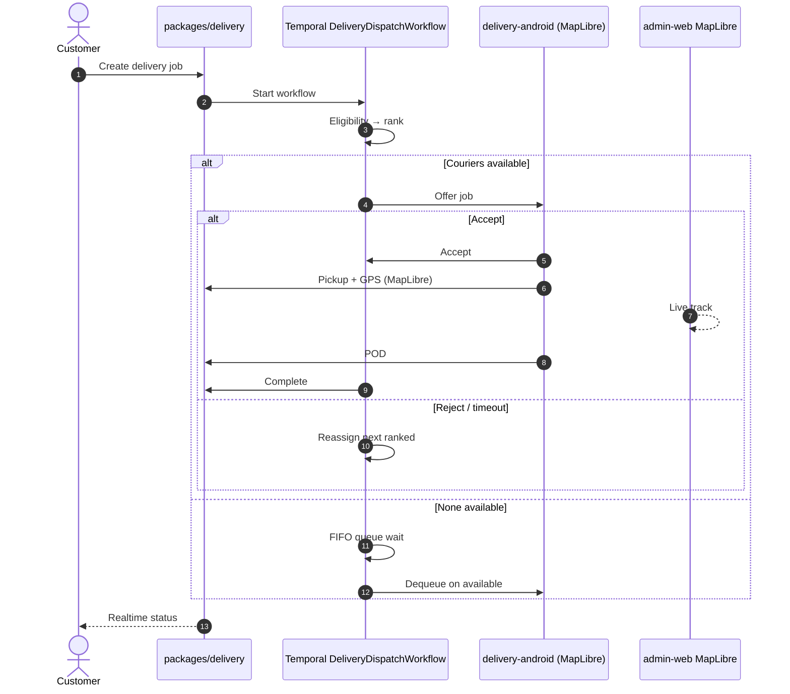

# Delivery dispatch swimlane (editorial brief)

**Type:** Swimlane / sequence (`dial-diagram-editorial`)  
**Audience:** Eng  
**Locks:** D-44 MapLibre/OSRM/VROOM; D-45 `packages/delivery` + Temporal  
**Must show:** Offer → accept → pickup → POD; FIFO when none  
**Must not show:** Fleetbase as job SoR; Google/Mapbox as distance SoR

**Focal accent:** Temporal workflow node — job engine SoR.
