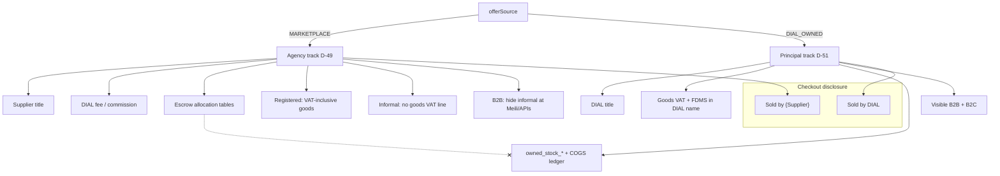

# Dual capacity — MARKETPLACE vs DIAL_OWNED (editorial brief)

**Type:** Nested / venn-style flowchart (`dial-diagram-editorial`)  
**Audience:** Eng / counsel / ops  
**Locks:** D-49 agency default; D-51 owned principal SKUs only  
**Must show:** Separate COGS/inventory; seller disclosure; no marketplace-wide flip  
**Must not show:** Informal→B2B visibility; mixing owned title with agency escrow

**Focal accent:** `DIAL_OWNED` + ring-fenced COGS — never reuse agency escrow tables for title.  
**OPEN (not shown as settled):** D-2 counsel may require entity split — product default remains same entity + cost centre until counsel says otherwise.
