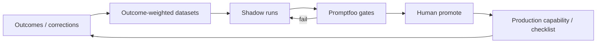
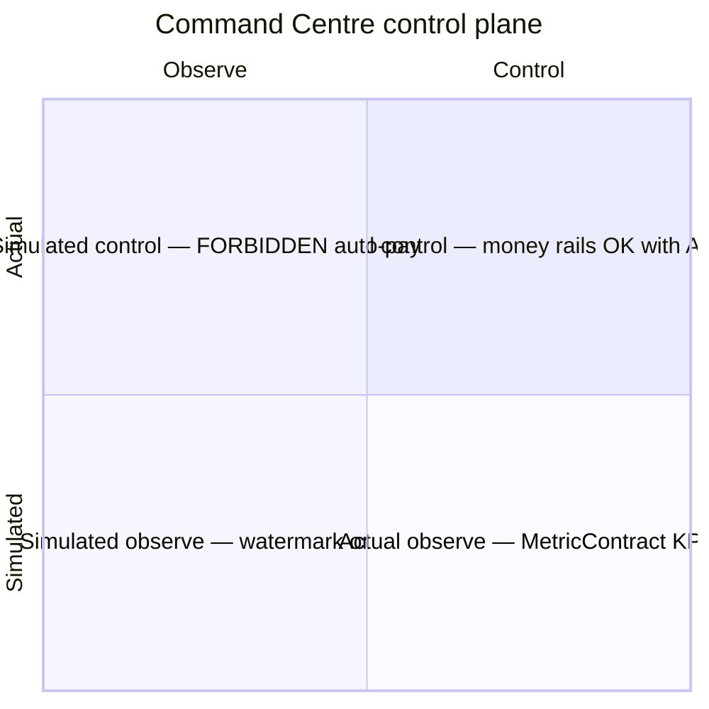

# Intelligence Factory loop + Command Centre Actual vs Simulated (editorial brief)

**Type:** Loop + quadrant callout (`dial-diagram-editorial`)  
**Audience:** Eng / ops  
**Locks:** D-54 — human+Promptfoo promote; Simulated never auto-pays; MetricContract  
**Bonus diagram** (with money / delivery / dual-capacity set)

**Lock callouts:** no silent auto-publish; Simulated watermark; every KPI has `MetricContract`; AI never writes payable amounts.
