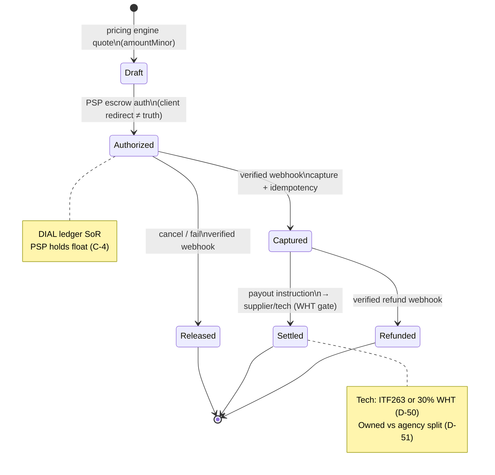

# Job Reserve state machine (editorial brief)

**Type:** State machine (`dial-diagram-editorial`)  
**Audience:** Eng / ops  
**Locks:** C-4, amountMinor, webhook-as-truth, AI never writes money  
**Must show:** PSP holds float; DIAL ledger; webhooks as truth  
**Must not show:** Medusa/OfferKit as money SoR; AI writing capture amounts

**Focal accent:** `Captured` / webhook edge — never trust return URL alone.
